# Análisis de Operandos en Inksolver

## 🔢 Definición de los Operandos

En el sistema **Inksolver**, los operandos corresponden a los **números de una sola cifra del 0 al 9**. Estos dígitos son fundamentales para la representación de las operaciones matemáticas que el sistema debe interpretar y resolver.

Cada dígito es tratado como una clase independiente y debe ser identificado correctamente a partir de su representación escrita a mano.

---

## 📃 Fuente de los Datos

Las imágenes de operandos utilizadas en **Inksolver** provienen de un subconjunto seleccionado del dataset **[Handwritten Math Symbols](https://www.kaggle.com/datasets/xainano/handwrittenmathsymbols)** alojado en Kaggle. Este conjunto contiene miles de imágenes escritas a mano que incluyen tanto símbolos matemáticos como dígitos numéricos.

Para el caso de los operandos, se utilizaron exclusivamente las imágenes etiquetadas con los dígitos del **0 al 9**, sin realizar modificaciones en el contenido original ni aplicar filtros adicionales. Esto asegura una representación variada y realista de la escritura manuscrita de cada número.

### 🖼️ Ejemplo de Imágenes de Operandos

A continuación, se presenta una muestra visual con ejemplos de operandos para cada una de las 10 clases disponibles (del 0 al 9), que refleja la variabilidad de la escritura manuscrita:

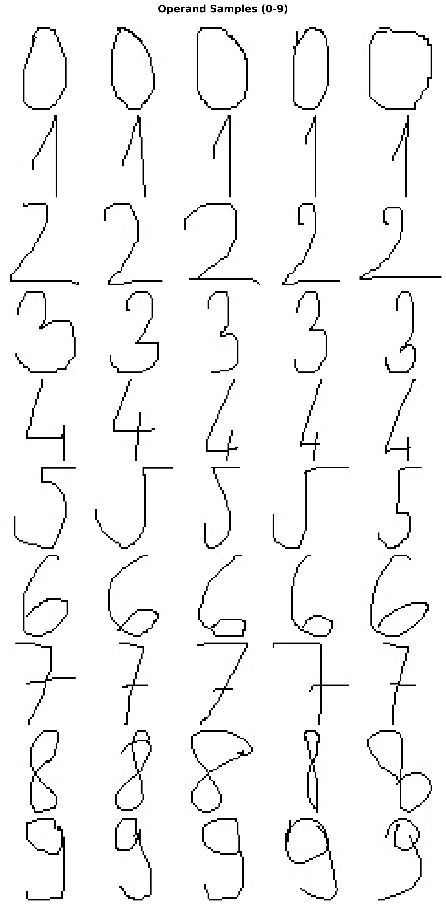

Esta imagen permite observar cómo cambia la forma de un mismo número dependiendo de la persona que lo escribió. Esta variación justifica la necesidad de aplicar técnicas robustas para su análisis y clasificación.

### 📊 Distribución de las Imágenes en el Dataset

Para entender mejor la composición del dataset, se generó un histograma con la cantidad de imágenes disponibles para cada dígito. Esto permite detectar posibles desequilibrios en el número de ejemplos por clase.

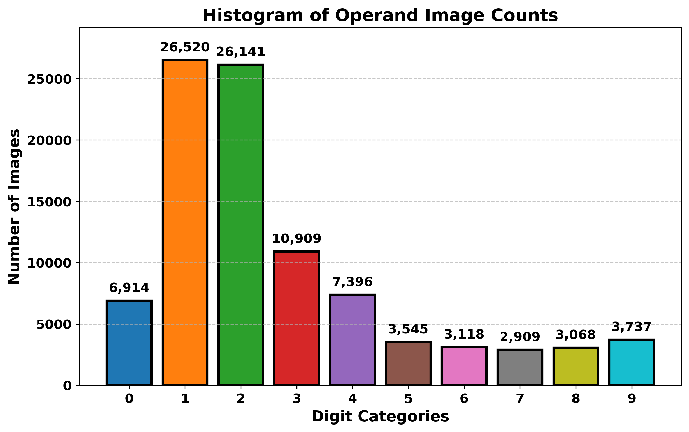

En este histograma se observa la cantidad de imágenes disponibles para cada uno de los operadores utilizados en **Inksolver**. Se pueden destacar los siguientes puntos clave:

- **Los dígitos `1` y `2` son los más representados**, con más de 26,000 imágenes cada uno, lo cual puede influir positivamente en la precisión del modelo para estas clases.

- **El dígito `3` también cuenta con una buena representación (10,909 imágenes)**, seguido por `4` con 7,396 y `0` con 6,914 ejemplos.

- **Los dígitos `5`, `6`, `7`, `8` y `9` tienen una representación significativamente menor**, con menos de 4,000 ejemplos cada uno. Esta diferencia podría afectar negativamente el rendimiento del modelo en estas clases debido a la menor cantidad de muestras para aprender sus características.

- **El dígito `7` es el menos representado**, con apenas 2,909 imágenes disponibles en el conjunto de datos.

Este análisis resalta un **desequilibrio evidente en la distribución de clases**, lo cual es importante tener en cuenta para etapas posteriores de entrenamiento, evaluación y validación del modelo.

### 📈 Proporción de Operandos en el Dataset

Además del conteo absoluto, se analizó la proporción relativa de cada dígito dentro del conjunto total de operandos. Esto se visualiza mediante un gráfico de pastel que muestra cómo se distribuyen los datos entre las distintas clases.

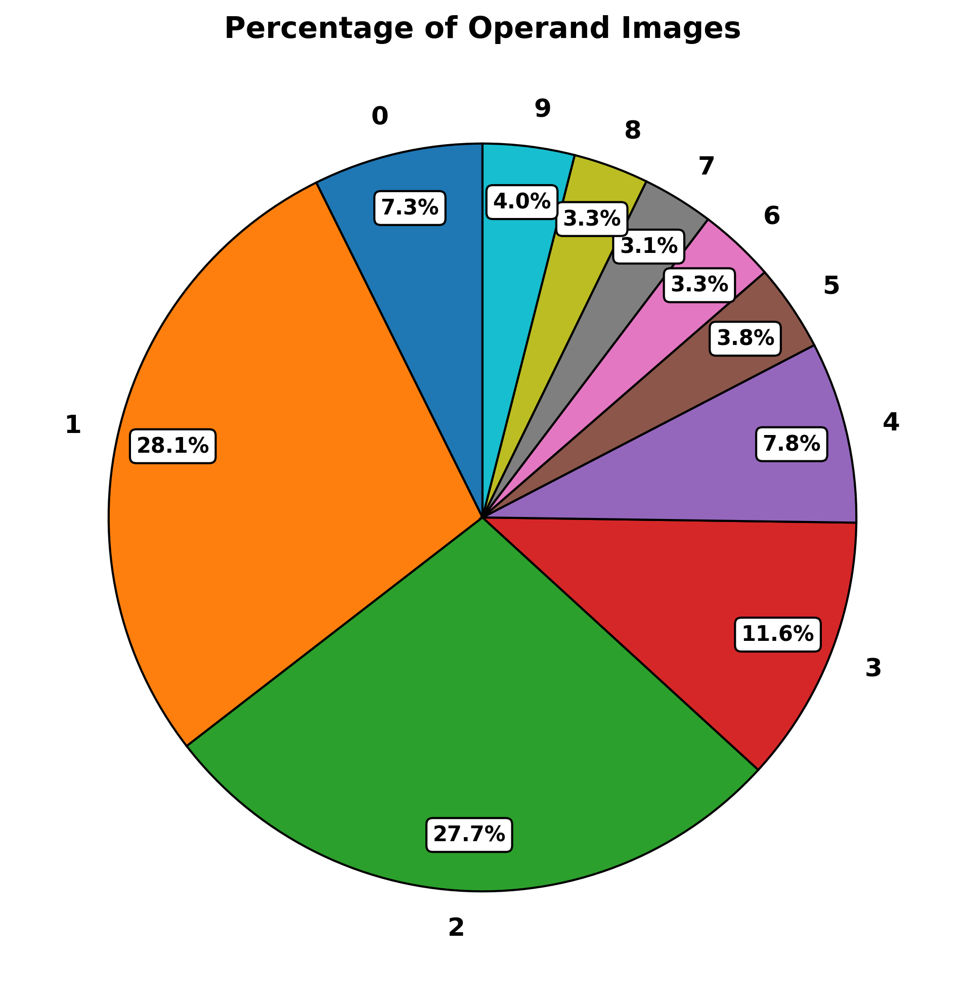

Este gráfico permite visualizar la participación relativa de cada operando dentro del dataset. Se puede observar que:

- **Los dígitos `1` y `2` dominan el conjunto de datos**, representando juntos más del **55%** del total de imágenes (`1` con 28.1% y `2` con 27.7%). Esto puede facilitar la clasificación de estos dígitos, pero también generar un sesgo del modelo hacia ellos.

- **El dígito `3` ocupa el tercer lugar**, con un 11.6% de participación, aún con una representación considerable.

- **Los dígitos `0` y `4` tienen una representación intermedia**, con un 7.3% y 7.8% respectivamente.

- **Los dígitos `5` al `9` están poco representados**, con porcentajes que van del **3.1% al 4.0%**, lo cual podría impactar negativamente la capacidad del modelo para aprender patrones confiables para estas clases.

Este desequilibrio en la distribución de clases refuerza la necesidad de considerar técnicas de compensación o balanceo si se desea entrenar un modelo robusto que funcione bien en todos los operandos por igual.

---

### 🖥️ Generación de las Gráficas

Todas las gráficas presentadas en esta sección han sido generadas mediante **scripts en Python** que forman parte del repositorio de **Inksolver**. Estos scripts se encuentran en la carpeta `src/operands/` y permiten visualizar y analizar los datos del conjunto de operadores.

Los archivos disponibles en esta carpeta son:

- **`histogram_operators.py`** → Genera el histograma de distribución de operadores (`operator_histogram.png`).
- **`piechart_operators.py`** → Genera el gráfico de pastel con la proporción de operadores (`operator_piechart.png`).
- **`visualize_operators.py`** → Genera una muestra de imágenes de operadores (`operator_samples.png`).

Para ejecutar cada uno de estos scripts correctamente, sigue los siguientes pasos:

1. **Abrir una terminal** y navegar a la carpeta de los scripts con el siguiente comando:
   ```bash
   cd src/operands/
   ```

2. **Ejecutar el script deseado** con el intérprete de Python:
   ```bash
   python visualize_operands.py
   ```
   ```bash
   python analyze_operands.py
   ```

Esto generará automáticamente las imágenes en la carpeta de salida definida en cada script.

📌 **Nota:** Asegúrate de tener instaladas las dependencias necesarias ejecutando:
```bash
pip install -r src/requirements.txt
```
Si los scripts requieren modificaciones o ajustes en la visualización, puedes editarlos directamente en la carpeta `src/operands/`.

---

## 🤖 Método de Reconocimiento de Operandos

El reconocimiento de operandos en **Inksolver** se basa en un enfoque sencillo pero efectivo de extracción de características basado en cuadrículas, también conocido como **grid-based features**. Este método permite representar la estructura espacial de los dígitos manuscritos de forma compacta y significativa.

La idea principal consiste en **dividir cada imagen en una cuadrícula regular**, de tamaño **3×3**, creando así **9 celdas** que cubren toda la imagen. Luego, se realiza el siguiente análisis:

- Para **cada celda**, se **cuenta la cantidad de píxeles activos (negros)**, que corresponden a las partes escritas del dígito.
- Estos conteos se organizan en un **vector de características corto**, con una posición por cada celda. En el caso de una cuadrícula 3×3, se obtiene un vector de **9 valores**.

Este vector se convierte en la **representación numérica del operando**, y puede ser utilizado para comparar con ejemplos promedio de cada clase, facilitando la clasificación.

Este enfoque permite capturar información estructural importante del dígito manuscrito, como:

- La **posición de las curvas** o trazos principales.
- Si el número tiene componentes **altos o bajos**, **hacia la izquierda o la derecha**.
- Diferencias generales en la distribución espacial del contenido del dígito.

Gracias a esta representación compacta, el sistema puede distinguir patrones generales entre distintas clases de dígitos, incluso cuando existen variaciones en la escritura manuscrita.

---

### 📌 1. Creación de la Grilla 3x3

Para facilitar el análisis estructural de los operandos manuscritos, cada imagen es procesada mediante la superposición de una **grilla de 3×3 celdas**. Esta cuadrícula permite dividir el espacio de la imagen en nueve regiones iguales, facilitando la identificación de patrones espaciales en la distribución de los píxeles activos.

La figura a continuación muestra una recopilación de ejemplos de cada dígito del 0 al 9 con su respectiva grilla superpuesta:

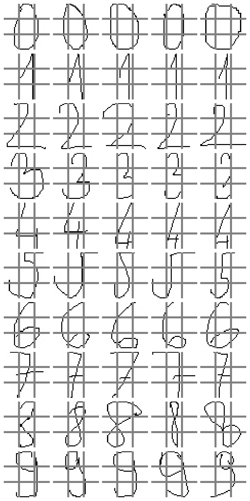

Esta visualización permite observar cómo se distribuyen los trazos de cada número dentro de las distintas celdas, lo cual es fundamental para el enfoque de extracción de características basado en cuadrantes.

A continuación, se presentan algunos ejemplos representativos para cada dígito, junto con una breve observación sobre cómo se comportan en relación con la grilla:

---

#### 🔢 Dígito 0
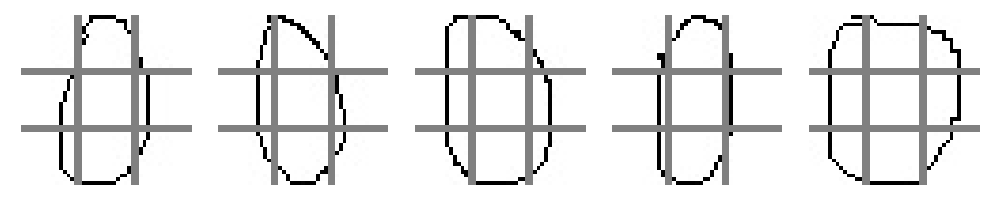

El dígito 0 suele ocupar el espacio central y las esquinas, especialmente las celdas **superiores** e **inferiores**. Su forma ovalada genera actividad en casi todas las regiones de la imagen.

---

#### 🔢 Dígito 1
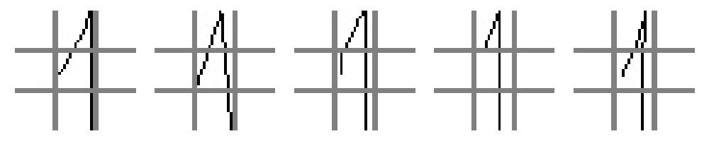

El dígito 1 presenta una distribución muy vertical, con concentración de píxeles en las **celdas centrales** y especialmente en la **columna derecha**, dependiendo de la inclinación del trazo.

---

#### 🔢 Dígito 2
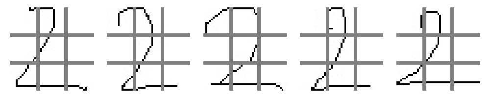

El número 2 tiene una presencia marcada en la **parte superior** y en la **parte inferior derecha**, por la curvatura del trazo final. Su trazo característico lo hace destacar en esas zonas.

---

#### 🔢 Dígito 3
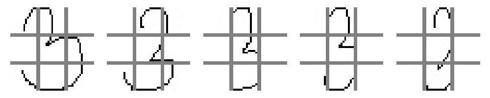

El dígito 3 genera actividad en la **mitad derecha de la grilla**, tanto superior como inferior. La doble curvatura lo hace fácilmente distinguible en este tipo de análisis espacial.

---

#### 🔢 Dígito 4
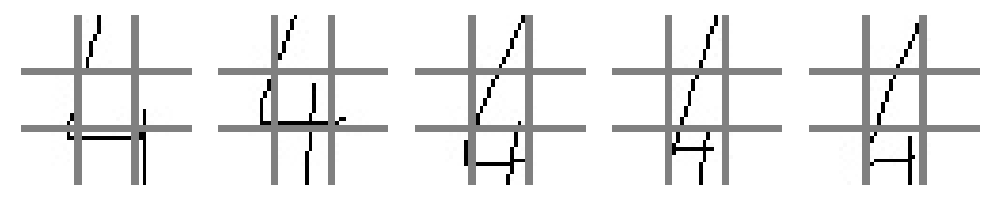

El número 4 destaca por tener trazos en la **parte superior izquierda** y **parte inferior derecha**, generando un patrón asimétrico muy útil para su identificación.

---

#### 🔢 Dígito 5
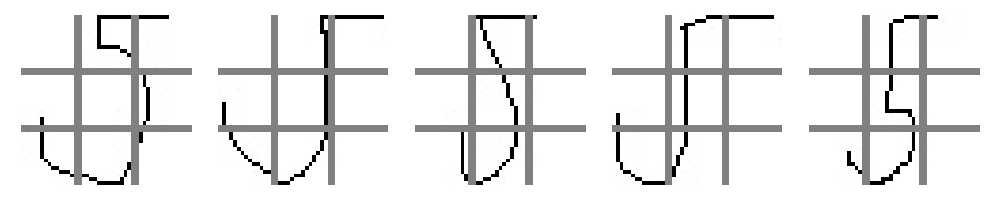

El dígito 5 tiene presencia en la **parte superior izquierda** y **parte inferior derecha**, con trazos que a menudo cruzan por el centro, generando un patrón en diagonal.

---

#### 🔢 Dígito 6


El número 6 tiende a ocupar la **parte inferior** de la imagen, con una curva hacia la izquierda que genera actividad especialmente en la **zona inferior izquierda** y el **centro**.

---

#### 🔢 Dígito 7
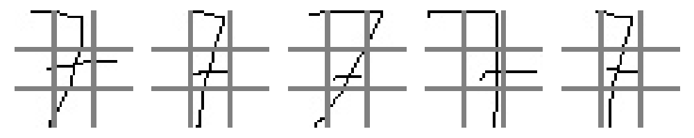

El dígito 7 se caracteriza por su trazo horizontal superior y la línea descendente hacia la derecha, lo que se traduce en una fuerte actividad en las **celdas superiores** y **centrales derechas**.

---

#### 🔢 Dígito 8
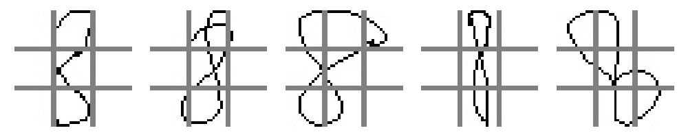

El número 8 es probablemente el más equilibrado espacialmente, con actividad intensa en **todas las regiones de la grilla**, debido a sus dos bucles simétricos.

---

#### 🔢 Dígito 9
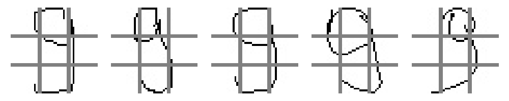

El dígito 9 concentra su trazo en la **parte superior** de la grilla, con una curvatura que se encierra en la parte derecha, generando actividad principalmente en las **celdas superiores y centrales derechas**.

---

Este análisis visual es clave para comprender cómo la representación por cuadrantes permite al sistema capturar patrones únicos que distinguen a cada operando manuscrito.

---

### 🖥️ Código para la Generación de las Grillas

La generación de las imágenes de operandos con la **grilla 3×3 superpuesta** se realiza mediante un script específico llamado **`operands_grid_viewer.py`**, el cual forma parte del repositorio de **Inksolver**. Este script permite visualizar y guardar ejemplos con la cuadrícula aplicada, lo cual es útil tanto para análisis visual como para depuración del sistema de reconocimiento.

El archivo se encuentra ubicado en la siguiente ruta dentro del proyecto:

```
src/operands/operands_grid_viewer.py
```

Para ejecutar este script y generar las imágenes con grilla, sigue los pasos a continuación:

1. **Abrir una terminal** y navegar a la carpeta correspondiente con el siguiente comando:
   ```bash
   cd src/operands/
   ```

2. **Ejecutar el script con el intérprete de Python**:
   ```bash
   python operands_grid_viewer.py
   ```

Esto generará automáticamente las imágenes con grilla para cada dígito del 0 al 9, así como una imagen resumen con todos ellos, en la carpeta de salida definida en el código.

📌 **Nota:** Asegúrate de tener instaladas las dependencias necesarias ejecutando:
```bash
pip install -r src/requirements.txt
```

Si el script requiere ajustes (por ejemplo, cambiar el tamaño de la grilla o modificar la visualización), puedes editarlo directamente en la carpeta `src/operands/`.

---

### 📌 2. Cálculo de Porcentajes de Píxeles

Una vez generada la grilla 3×3 sobre cada imagen, el siguiente paso en el proceso de reconocimiento es calcular el **porcentaje de píxeles activos (o “tinta”)** dentro de cada celda de la grilla. Esta métrica nos permite cuantificar la distribución espacial del contenido manuscrito y construir un **vector numérico de características** para cada imagen.

#### 🧮 ¿Cómo se calcula?

El procedimiento es el siguiente:

1. **Dividir la imagen** en 9 celdas iguales, según la grilla 3×3.
2. Para **cada celda**, contar la cantidad de píxeles oscuros (habitualmente los de color negro) presentes.
3. Dividir ese valor por la **cantidad total de píxeles de la celda**, obteniendo así un **porcentaje de ocupación**.
4. Repetir el proceso para todas las celdas, generando un vector de 9 valores que representa la proporción de tinta en cada región.

Este vector resume de manera simple pero efectiva **dónde se encuentra la mayor concentración de trazos** en la imagen del dígito.

#### 🖼️ Visualización del porcentaje de tinta

A continuación se muestra un conjunto de imágenes de operandos, esta vez con **celdas coloreadas** en tonos rojizos para representar el porcentaje de píxeles activos. Cuanto más intensa es la celda, mayor es la cantidad de tinta en esa región.

La siguiente imagen muestra todos los dígitos juntos, permitiendo observar los patrones característicos:

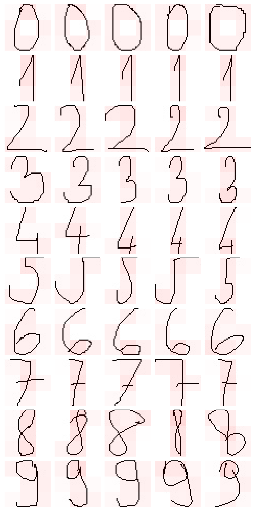

---

#### 🔢 Dígito 0
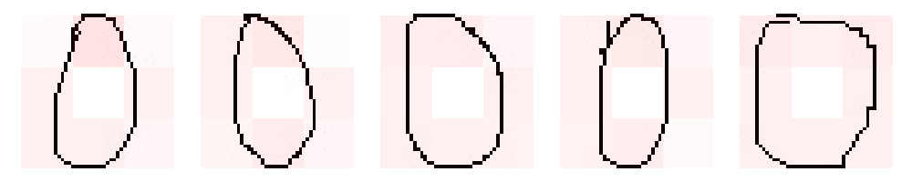

Se observa una **distribución equilibrada** con mayor presencia en las celdas **superior**, **central** e **inferior**, confirmando su forma ovalada envolvente.

---

#### 🔢 Dígito 1
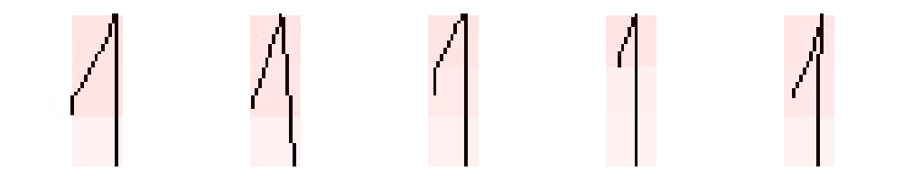

El trazo del número 1 se concentra principalmente en la **columna derecha** y la **zona central**, generando celdas muy marcadas en esas posiciones y muy claras en las demás.

---

#### 🔢 Dígito 2
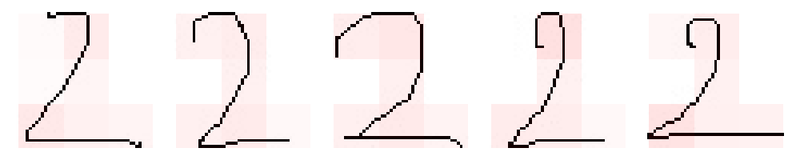

Destaca la presencia en la **parte superior** y en la **esquina inferior derecha**, lo que se corresponde con el trazo curvo descendente característico del número 2.

---

#### 🔢 Dígito 3
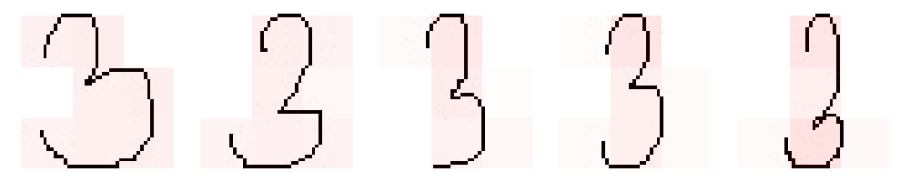

El dígito 3 muestra **alta actividad en la columna derecha**, tanto en la parte superior como inferior, con una celda central también destacada, debido a la doble curva.

---

#### 🔢 Dígito 4
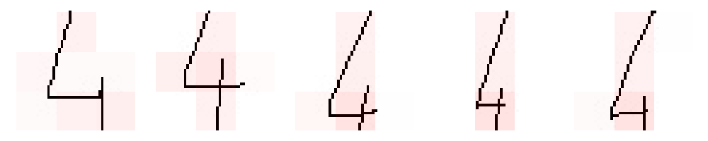

Predominan los trazos en la **parte superior izquierda** y **parte inferior derecha**, reflejando la estructura en forma de "L" o de "triángulo abierto" que algunos estilos de escritura utilizan para este número.

---

#### 🔢 Dígito 5
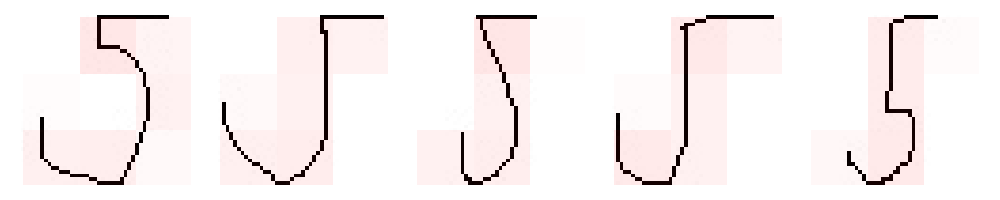

El trazo superior izquierdo y la **curva en la parte inferior derecha** producen un patrón diagonal claro en las celdas, lo cual coincide con las observaciones de la sección anterior.

---

#### 🔢 Dígito 6
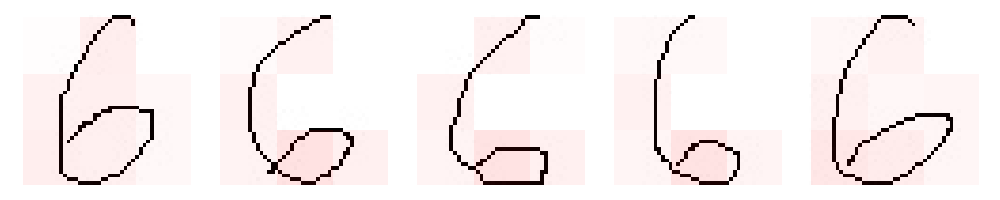

Las celdas más activas se concentran en la **zona inferior izquierda** y el **centro**, lo que refleja la típica espiral descendente del número 6.

---

#### 🔢 Dígito 7
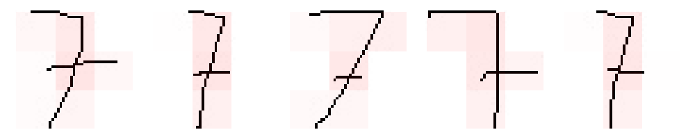

La **parte superior** y la **columna derecha** son las más marcadas, coherente con su trazo horizontal superior y línea inclinada.

---

#### 🔢 Dígito 8
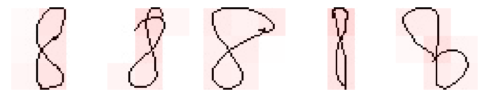

El dígito 8 tiene tinta repartida **casi uniformemente** entre todas las celdas, lo que es coherente con su forma de doble círculo.

---

#### 🔢 Dígito 9
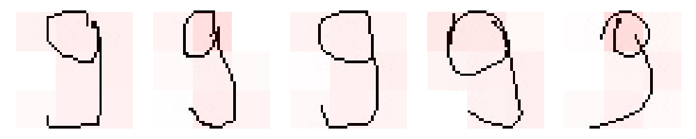

Concentración de tinta en la **parte superior derecha** y el **centro**, lo que confirma su trazo curvo descendente desde la parte superior.

---

Estos mapas de calor visuales validan y complementan el análisis anterior, demostrando que los patrones espaciales capturados por la grilla 3×3 son coherentes y distintivos para cada dígito. Esta representación proporciona una **base sólida para tareas de clasificación posterior**.

---

### 🖥️ Código para el Cálculo de Porcentajes de Píxeles

El cálculo y visualización de los porcentajes de tinta en cada celda de la grilla 3×3 se realiza mediante el script **`operands_ink_density_viewer.py`**, el cual también forma parte del módulo de análisis de operandos de **Inksolver**.

Este script aplica el proceso de segmentación por cuadrantes y calcula el porcentaje de píxeles activos (negros) en cada celda, generando una representación visual mediante sombreado o coloración que refleja la densidad relativa de tinta en cada región.

El archivo se encuentra en la siguiente ubicación dentro del proyecto:

```
src/operands/operands_ink_density_viewer.py
```

Para ejecutar el script y generar las imágenes con celdas coloreadas según la densidad de tinta, realiza los siguientes pasos:

1. **Abrir una terminal** y navegar a la carpeta del script:
   ```bash
   cd src/operands/
   ```

2. **Ejecutar el script con Python**:
   ```bash
   python operands_ink_density_viewer.py
   ```

Esto generará automáticamente las imágenes con sombreado por porcentaje de píxeles para cada dígito, así como una imagen general que los incluye a todos, en la carpeta de salida especificada en el script.

📌 **Nota:** Asegúrate de tener instaladas las dependencias necesarias ejecutando:
```bash
pip install -r src/requirements.txt
```

Si deseas personalizar el tamaño de la grilla, cambiar la intensidad del sombreado, o ajustar los formatos de salida, puedes modificar el script directamente en `src/operands/`.

---

### 📌 3. Determinación de Promedio de Dígitos

Una vez extraídos los vectores de proporciones de tinta para cada imagen (uno por operando), se procede a calcular una **huella digital promedio** para cada dígito del 0 al 9. Este proceso consiste en **promediar el valor de cada celda de la grilla 3×3** entre todas las imágenes correspondientes a un mismo número.

#### 🧮 ¿Cómo se calcula el promedio?

1. Para cada clase (dígito), se recopilan todos los vectores de 9 valores generados por las imágenes etiquetadas con ese número.
2. Se suman los valores correspondientes de cada celda en todos los vectores.
3. Se divide cada suma por la cantidad total de ejemplos, obteniendo así un vector promedio representativo de esa clase.
4. Este vector se puede visualizar como un mapa de calor, donde cada celda refleja la **intensidad media de tinta** esperada en esa región para el dígito correspondiente.

#### 📊 Visualización de huellas digitales promedio

La siguiente figura muestra la **huella digital promedio por dígito**, en formato de grilla 3×3. Los valores representan el porcentaje promedio de píxeles oscuros en cada celda, y los colores reflejan la intensidad relativa de tinta (máximo ajustado al 20% para facilitar la comparación):

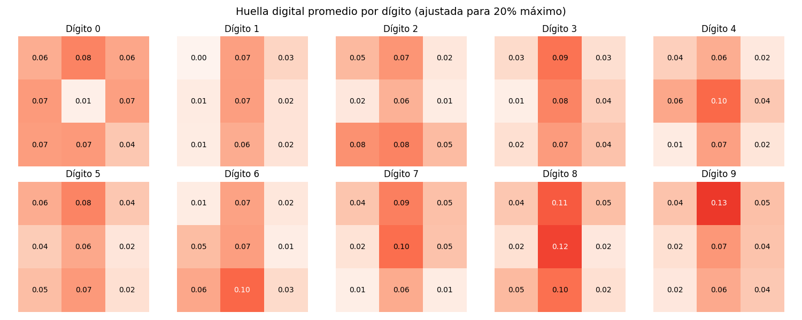

#### 📌 Importancia de estas huellas

Estas huellas promedio permiten identificar los **patrones espaciales característicos** de cada dígito manuscrito. Por ejemplo:

- El dígito `8` muestra **alta actividad en casi todas las celdas**, por su forma cerrada doble.
- El `1` se concentra en la **columna central**, con muy poca presencia en otras áreas.
- El `7` y el `9` tienen marcada la **fila superior**, mientras que el `6` destaca en la **parte inferior**.
- El `3` y el `5` presentan un patrón en la **columna derecha**, por la dirección de sus curvas.

Estos promedios no solo permiten analizar el comportamiento típico de cada dígito, sino que también sirven como **referencia de comparación** en procesos de clasificación: una imagen nueva puede ser comparada con cada una de estas huellas para determinar cuál se le parece más.

En la siguiente sección se explicará cómo se realiza este proceso de comparación.

---

### 🖥️ Código para la Determinación de Promedios

La generación de las huellas digitales promedio por dígito y su representación en forma de mapa de calor se realiza a través de una secuencia de tres scripts principales. Estos scripts se encuentran en la carpeta `src/operands/` y forman parte del flujo de cálculo y visualización del promedio de densidad de tinta por clase.

A continuación, se describe el propósito de cada uno:

---

#### 1. `generate_ink_density_csv.py`

Este script aplica el algoritmo de grilla 3×3 a cada imagen del conjunto de entrenamiento y **calcula el porcentaje de píxeles activos por celda**. Luego guarda un archivo CSV por cada ejemplo, organizados en subcarpetas según su dígito correspondiente.

- 📁 **Salida**: Los archivos CSV individuales se almacenan dentro de la carpeta `csv_por_digito/`.

---

#### 2. `operands_ink_density_avg.py`

Una vez generados los archivos CSV por ejemplo, este script **lee todos los vectores asociados a un mismo dígito** y calcula su **promedio por celda**. El resultado es un vector promedio representativo de la densidad de tinta para cada clase.

- 📁 **Salida**: Un archivo `promedios_por_digito.csv` que contiene el promedio de cada celda para cada dígito (10 vectores, uno por clase).

---

#### 3. `ink_density_heatmaps.py`

Este script toma como entrada el archivo `promedios_por_digito.csv` generado en el paso anterior y **genera un mapa de calor visual** para cada clase, así como una imagen compuesta con todos los dígitos.

- 🖼️ **Salida**: La imagen `huella_promedio.png`, ubicada en la carpeta `images/`, que muestra de forma comparativa la huella promedio de todos los dígitos manuscritos.

---

#### ▶️ Ejecución paso a paso

Para ejecutar todo el proceso desde cero, sigue estos pasos:

1. Abre una terminal y navega a la carpeta de los scripts:
   ```bash
   cd src/operands/
   ```

2. Genera los archivos CSV individuales por imagen:
   ```bash
   python generate_ink_density_csv.py
   ```

3. Calcula el promedio por dígito:
   ```bash
   python operands_ink_density_avg.py
   ```

4. Genera el mapa de calor a partir de los promedios:
   ```bash
   python ink_density_heatmaps.py
   ```

📌 **Nota:** Verifica que tengas todas las dependencias instaladas ejecutando:
```bash
pip install -r src/requirements.txt
```

Este conjunto de scripts permite automatizar completamente el análisis estadístico y visual de la distribución de tinta por clase, proporcionando una base sólida para la etapa de clasificación.

---

### 📌 4. Reglas de Detección

Una vez obtenidas las **huellas digitales promedio** para cada dígito (vectores de 9 valores que representan la densidad de tinta por celda), es posible utilizarlas como referencia para clasificar nuevos ejemplos.

El proceso de detección se basa en una **comparación entre el vector de características de una nueva imagen y los vectores promedio de cada clase**. Para ello, se utiliza una métrica de distancia, típicamente la **distancia euclidiana**, para medir qué tan similar es el nuevo vector a cada uno de los promedios almacenados.

#### 🔎 Clasificación paso a paso

1. Se extrae el vector de 9 valores del nuevo operando utilizando el mismo procedimiento de grilla 3×3 y cálculo de porcentajes de tinta.
2. Se calcula la **distancia euclidiana** entre este vector y los vectores promedio de cada dígito (del 0 al 9).
3. Se selecciona como predicción el dígito cuyo vector promedio esté **más cerca** (menor distancia) del vector del nuevo ejemplo.

Este método de clasificación es simple pero efectivo cuando los patrones promedio están bien definidos y diferenciados.

---

#### 📊 Visualización de distancias entre dígitos

La siguiente figura muestra una **matriz de distancia euclidiana** entre los vectores promedio de cada par de dígitos. Esta matriz permite visualizar qué dígitos tienen huellas más parecidas entre sí, y cuáles son más distinguibles.

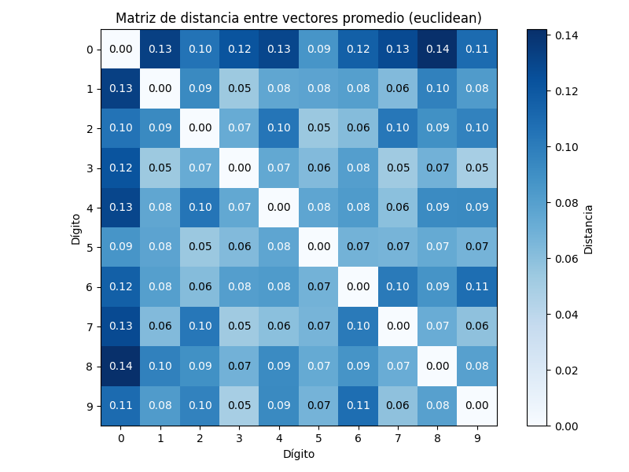

Algunas observaciones clave:

- **Dígitos como el `1` y el `7` o el `3` y el `9` muestran distancias relativamente pequeñas**, lo cual puede generar confusión durante la clasificación si no se refinan los vectores o se aplica preprocesamiento adicional.
- El **dígito `8` tiene una huella bastante distintiva**, con distancias relativamente altas frente a la mayoría de los demás.
- La **simetría de la matriz** confirma que la distancia entre `A` y `B` es la misma que entre `B` y `A`.

Esta matriz no solo ayuda a entender las **similitudes entre clases**, sino que también permite identificar **casos problemáticos** que podrían beneficiarse de técnicas adicionales, como normalización más fina, aumento de datos o clasificadores más avanzados.

---

Este enfoque de clasificación por distancia al promedio representa una solución interpretativa y eficiente, ideal para sistemas de reconocimiento de patrones simples como el que se plantea en **Inksolver**.

---

### 🖥️ Código para la Comparación y Clasificación

El proceso de comparación entre vectores promedio y la generación de la **matriz de distancias** se encuentra implementado en el script **`operands_distance_matrix.py`**, disponible en la carpeta `src/operands/` del proyecto **Inksolver**.

Este script calcula la **distancia euclidiana** entre cada par de vectores promedio obtenidos previamente, y genera una matriz cuadrada de 10×10 que refleja la similitud entre las huellas digitales de los distintos dígitos manuscritos.

#### 🔧 Funcionalidades del script:

- Lee el archivo `promedios_por_digito.csv` generado previamente con las huellas promedio.
- Calcula la **distancia euclidiana** entre todos los pares de vectores promedio (uno por dígito).
- Genera una **matriz visual** donde se colorean las distancias, facilitando la interpretación.
- Guarda la visualización en una imagen llamada:
  ```
  images/matriz_distancia_euclidean.png
  ```

#### ▶️ Cómo ejecutar el script

1. Abre una terminal y navega a la carpeta de trabajo:
   ```bash
   cd src/operands/
   ```

2. Ejecuta el script con Python:
   ```bash
   python operands_distance_matrix.py
   ```

📌 **Nota:** Asegúrate de tener instaladas las dependencias necesarias con:
```bash
pip install -r src/requirements.txt
```

Este script permite entender la **relación de similitud entre las clases**, y sirve de base para construir clasificadores basados en distancias, como el utilizado en **Inksolver**.

---

### 📊 Validación del Modelo

Para validar el sistema de clasificación desarrollado en **Inksolver**, se diseñó e implementó un clasificador manual basado en distancias euclidianas entre los vectores de densidad de tinta (calculados mediante la grilla 3×3) y los vectores promedio correspondientes a cada dígito manuscrito.

---

#### 🧠 Descripción del algoritmo de clasificación

El algoritmo está implementado en el script **`operands_manual_classifier.py`**, y realiza el siguiente procedimiento para cada imagen:

1. **Carga los vectores promedio por dígito** desde el archivo `promedios_por_digito.csv`.
2. **Lee los vectores individuales** de cada imagen desde los archivos CSV por dígito.
3. **Calcula la distancia euclidiana** entre el vector de la imagen actual y cada uno de los vectores promedio.
4. **Asigna la clase (dígito) con menor distancia** como predicción del modelo.
5. Guarda los resultados en un archivo CSV junto con el dígito real.

A continuación, se muestra un fragmento clave del código que realiza la predicción:

```python
# Calcular distancias a cada prototipo
distancias = {
    protodig: euclidean(vector, v)
    for protodig, v in vectores_promedio.items()
}

# Elegir el dígito con menor distancia
digito_predicho = min(distancias, key=distancias.get)
```

Este enfoque es interpretativo, directo y fácil de depurar, lo que lo hace ideal para el desarrollo inicial de clasificadores en sistemas educativos o experimentales como **Inksolver**.

---

#### 📈 Evaluación del modelo

Una vez completada la clasificación, se evaluó el desempeño del sistema utilizando el script **`evaluate_manual_classifier.py`**, el cual genera:

- La **matriz de confusión**, que muestra la frecuencia con la que cada dígito fue correctamente o incorrectamente clasificado.
- Métricas de evaluación por clase: precisión, recall, especificidad y F1-score.
- Precisión global del modelo.

---

#### 📊 Matriz de Confusión

La siguiente figura presenta la matriz de confusión generada a partir de todas las predicciones realizadas:

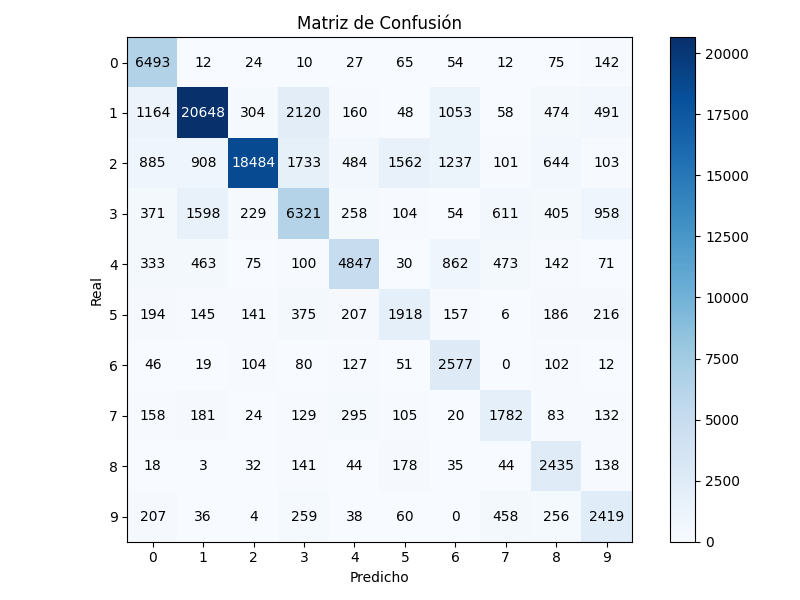

##### Observaciones:

- El modelo tiene buen desempeño en clases como **`1`**, **`2`** y **`0`**, con una gran cantidad de predicciones correctas en la diagonal principal.
- Los dígitos **`5`**, **`6`**, **`7`**, **`8`** y **`9`** muestran mayor dispersión, indicando confusión frecuente con otras clases.
- La clase **`3`** es especialmente ambigua, con muchos errores hacia clases como `1`, `2`, `5`, `8` y `9`.

---

#### ✅ Precisión global del modelo

La **precisión global** alcanzada por el sistema fue de:

```
🔢 Precisión global del modelo: 0.7206
```

Este valor representa la **proporción de ejemplos correctamente clasificados** con respecto al total de imágenes procesadas. Una precisión global del 72.06% sugiere que el clasificador logra resultados satisfactorios considerando la simplicidad del enfoque y la naturaleza variable de la escritura manuscrita. Sin embargo, también deja espacio para mejoras, especialmente en las clases con menor representación o formas más ambiguas.

---

#### 📊 Métricas por clase

| Dígito | Precisión | Recall | Especificidad | F1-Score |
|--------|-----------|--------|----------------|----------|
| 0      | 0.6579    | 0.9391 | 0.9613         | 0.7738   |
| 1      | 0.8599    | 0.7786 | 0.9503         | 0.8172   |
| 2      | 0.9518    | 0.7071 | 0.9862         | 0.8114   |
| 3      | 0.5610    | 0.5794 | 0.9406         | 0.5701   |
| 4      | 0.7472    | 0.6554 | 0.9811         | 0.6983   |
| 5      | 0.4654    | 0.5410 | 0.9757         | 0.5004   |
| 6      | 0.4260    | 0.8265 | 0.9619         | 0.5622   |
| 7      | 0.5027    | 0.6126 | 0.9807         | 0.5522   |
| 8      | 0.5071    | 0.7937 | 0.9740         | 0.6188   |
| 9      | 0.5167    | 0.6473 | 0.9750         | 0.5747   |

---

#### 📊 Análisis de Precisión por Dígito

Para comprender mejor el desempeño del modelo en cada operando, se presenta el siguiente análisis detallado de cada categoría evaluada en el conjunto de validación:

---

##### 🔹 **Dígito `0`**  
- **Precisión:** 65.79%  
- **Recall:** 93.91%  
- **Especificidad:** 96.13%  
- **F1-Score:** 77.38%  

📌 **Interpretación:**  
El modelo logra identificar correctamente la mayoría de los ceros reales (alto recall), aunque comete errores de clasificación con otras clases (precisión moderada). Esto refleja que el `0` tiene una huella digital distintiva, aunque en algunos casos puede confundirse con `6`, `8` o `9`.

---

##### 🔹 **Dígito `1`**  
- **Precisión:** 85.99%  
- **Recall:** 77.86%  
- **Especificidad:** 95.03%  
- **F1-Score:** 81.72%  

📌 **Interpretación:**  
El modelo presenta un rendimiento sobresaliente en la detección del dígito `1`, tanto en precisión como en F1-score. Su trazo vertical bien definido lo hace fácilmente diferenciable, aunque pueden ocurrir confusiones con `7` y `4`.

---

##### 🔹 **Dígito `2`**  
- **Precisión:** 95.18%  
- **Recall:** 70.71%  
- **Especificidad:** 98.62%  
- **F1-Score:** 81.14%  

📌 **Interpretación:**  
El dígito `2` es uno de los más precisos del modelo. Sin embargo, el recall más bajo indica que el sistema a veces no logra detectarlo cuando aparece, posiblemente debido a su gran variabilidad en escritura o similitud con `3` y `5`.

---

##### 🔹 **Dígito `3`**  
- **Precisión:** 56.10%  
- **Recall:** 57.94%  
- **Especificidad:** 94.06%  
- **F1-Score:** 57.01%  

📌 **Interpretación:**  
El dígito `3` muestra un rendimiento bajo y equilibradamente débil en todas las métricas. Esto puede estar relacionado con la forma ambigua del número y su similitud con `8`, `9` y en menor medida con `5`.

---

##### 🔹 **Dígito `4`**  
- **Precisión:** 74.72%  
- **Recall:** 65.54%  
- **Especificidad:** 98.11%  
- **F1-Score:** 69.83%  

📌 **Interpretación:**  
Aunque con buen nivel de precisión, el sistema pierde algunos verdaderos `4`, lo cual se refleja en un recall más moderado. Esto podría deberse a estilos de escritura que se asemejan a `1` o incluso `9`.

---

##### 🔹 **Dígito `5`**  
- **Precisión:** 46.54%  
- **Recall:** 54.10%  
- **Especificidad:** 97.57%  
- **F1-Score:** 50.04%  

📌 **Interpretación:**  
El modelo presenta dificultades con el dígito `5`, con una precisión y un F1-score bajos. Esto sugiere que es comúnmente confundido con otros dígitos como `3`, `2` y `6`, posiblemente por su forma curva inferior que se presenta en múltiples clases.

---

##### 🔹 **Dígito `6`**  
- **Precisión:** 42.60%  
- **Recall:** 82.65%  
- **Especificidad:** 96.19%  
- **F1-Score:** 56.22%  

📌 **Interpretación:**  
Aunque el modelo logra detectar muchos `6` (alto recall), también realiza muchas predicciones incorrectas como `6` (baja precisión). Esto puede reflejar que los patrones del `6` se superponen con los de `0` o `8` en algunas regiones.

---

##### 🔹 **Dígito `7`**  
- **Precisión:** 50.27%  
- **Recall:** 61.26%  
- **Especificidad:** 98.07%  
- **F1-Score:** 55.22%  

📌 **Interpretación:**  
El desempeño para `7` es intermedio. Su trazo recto y su forma angular deberían facilitar su detección, pero es probable que variantes en escritura manuscrita lo confundan con `1` o incluso `9`.

---

##### 🔹 **Dígito `8`**  
- **Precisión:** 50.71%  
- **Recall:** 79.37%  
- **Especificidad:** 97.40%  
- **F1-Score:** 61.88%  

📌 **Interpretación:**  
El `8` es bien detectado (recall alto), pero con precisión limitada, ya que su forma cerrada puede llevar a clasificaciones incorrectas hacia `0`, `3` o `9`. Su F1-score es uno de los más equilibrados en esta categoría.

---

##### 🔹 **Dígito `9`**  
- **Precisión:** 51.67%  
- **Recall:** 64.73%  
- **Especificidad:** 97.50%  
- **F1-Score:** 57.47%  

📌 **Interpretación:**  
El rendimiento del modelo en `9` es moderado. Este dígito tiende a confundirse con `3`, `8` y `4`, lo cual disminuye tanto su precisión como su recall. Su trazo superior cerrado y su parte inferior más libre pueden contribuir a estas ambigüedades.

---

#### 📌 Conclusiones de la Validación

La validación del clasificador manual de operandos desarrollado en **Inksolver** ofrece una visión clara del potencial y las limitaciones del enfoque basado en cuadrantes y comparación con vectores promedio. A continuación, se resumen los hallazgos más relevantes del proceso:

---

🔹 **Desempeño general del modelo:**  
Con una **precisión global del 72.06%**, el sistema demuestra una capacidad aceptable para reconocer dígitos manuscritos utilizando técnicas simples de representación espacial y distancia euclidiana. Este resultado es notable considerando que no se emplean técnicas de aprendizaje profundo ni transformaciones complejas.

---

🔹 **Fortalezas del enfoque:**  
- Los dígitos **`1`**, **`2`** y **`0`** muestran un rendimiento sobresaliente, lo que sugiere que sus **huellas digitales promedio están bien definidas** y sus patrones espaciales son **claramente distinguibles** por la grilla.
- El uso de **vectores de 9 componentes** ofrece una representación compacta y efectiva, suficiente para capturar las principales diferencias estructurales entre muchos de los dígitos.

---

🔹 **Limitaciones identificadas:**  
- Clases como **`3`**, **`5`**, **`6`**, **`8`** y **`9`** presentan **desempeños más bajos**, debido a la **alta variabilidad en la escritura manuscrita** y a similitudes estructurales que dificultan su discriminación con este método.
- El enfoque por distancia euclidiana no considera **características más sutiles** como la orientación o la forma de los trazos, lo que contribuye a errores en clases visualmente parecidas.

---

🔹 **Análisis de la matriz de confusión:**  
- Se observan confusiones frecuentes entre dígitos como **`3` y `9`**, **`5` y `3`**, **`7` y `1`**, lo cual está alineado con lo observado en los análisis por clase.
- Estas confusiones reflejan que el sistema se basa en una medida de similitud global sin incorporar mecanismos de atención o discriminación localizados.

---

🔹 **Fiabilidad del sistema por clase:**  
- Algunas clases alcanzan **niveles de precisión superiores al 85%**, lo que demuestra que el sistema es **confiable para ciertos dígitos** en contextos controlados o como parte de una solución más compleja.
- Sin embargo, otras clases presentan una **combinación desfavorable de baja precisión y bajo recall**, indicando que sería riesgoso confiar en estas predicciones sin una capa adicional de validación o filtrado.

---

📌 **Conclusión general:**  
El enfoque implementado en **Inksolver** para el reconocimiento de operandos manuscritos es **efectivo, interpretable y de bajo costo computacional**, siendo ideal para aplicaciones educativas, prototipos rápidos o entornos con recursos limitados. No obstante, para alcanzar niveles de precisión competitivos en todos los dígitos, será necesario **explorar técnicas complementarias** (como normalización avanzada, preprocesamiento morfológico o modelos de aprendizaje más complejos) que aborden las limitaciones observadas en esta validación.

---

### 🖥️ Código para la Clasificación y Validación

La etapa de clasificación y evaluación del rendimiento del modelo en **Inksolver** se encuentra completamente automatizada mediante dos scripts principales: **`operands_manual_classifier.py`** y **`evaluate_manual_classifier.py`**. Estos scripts permiten ejecutar todo el proceso de predicción sobre nuevos ejemplos y analizar de forma cuantitativa y visual el desempeño del clasificador.

---

#### 📄 `operands_manual_classifier.py`

Este script es responsable de ejecutar el **clasificador manual basado en distancias euclidianas**. Su función principal es tomar los vectores de tinta por cuadrante de cada imagen manuscrita y compararlos con los vectores promedio de cada clase (dígito del 0 al 9).

📌 **Ubicación del script:**  
```bash
src/operands/operands_manual_classifier.py
```

---

#### 📄 `evaluate_manual_classifier.py`

Este script realiza la **evaluación estadística del rendimiento del clasificador**, utilizando como insumo el archivo `clasificacion_resultados.csv` generado por el script anterior.

📌 **Ubicación del script:**  
```bash
src/operands/evaluate_manual_classifier.py
```

---

#### ▶️ Ejecución paso a paso

1. Clasificación de imágenes:
   ```bash
   cd src/operands/
   python operands_manual_classifier.py
   ```

2. Evaluación del modelo:
   ```bash
   python evaluate_manual_classifier.py
   ```

📌 **Nota:** Es importante haber generado previamente los archivos de densidad de tinta (`csv_por_digito`) y el archivo de promedios (`promedios_por_digito.csv`). Asegúrate también de tener instaladas todas las dependencias necesarias:

```bash
pip install -r src/requirements.txt
```

---

Estos dos scripts constituyen el **núcleo funcional del proceso de clasificación y validación**, permitiendo reproducir fácilmente los resultados y análisis presentados en esta sección.

---

## 📝 Generación de un Nuevo Conjunto de Datos y Validación  
