# Análisis de Operadores en Inksolver

## 🔢 Definición de los Operadores
El sistema **Inksolver** trabaja con los siguientes operadores matemáticos básicos:

- **Suma** (`+`) → Identificado como `sum`
- **Resta** (`-`) → Identificado como `sub`
- **Multiplicación** (`×`) → Identificado como `times`
- **División** (`/`) → Identificado como `div`
- **Igual** (`=`) → Identificado como `equals`

Estos nombres estandarizados facilitan el manejo de los operadores dentro del sistema y evitan ambigüedades en la detección y procesamiento.

---

## 📃 Fuente de los Datos
Las imágenes de los operadores utilizados en **Inksolver** provienen del conjunto de datos público **[Handwritten Math Symbols](https://www.kaggle.com/datasets/xainano/handwrittenmathsymbols?select=data.rar)** de Kaggle.

- **Preprocesamiento de Datos:** No se realizó ningún tipo de preprocesamiento o limpieza de datos en las imágenes originales del conjunto de datos.

A continuación, se muestran varias representaciones gráficas del conjunto de datos utilizadas en el análisis.

### 📌 Ejemplo de imágenes de operadores
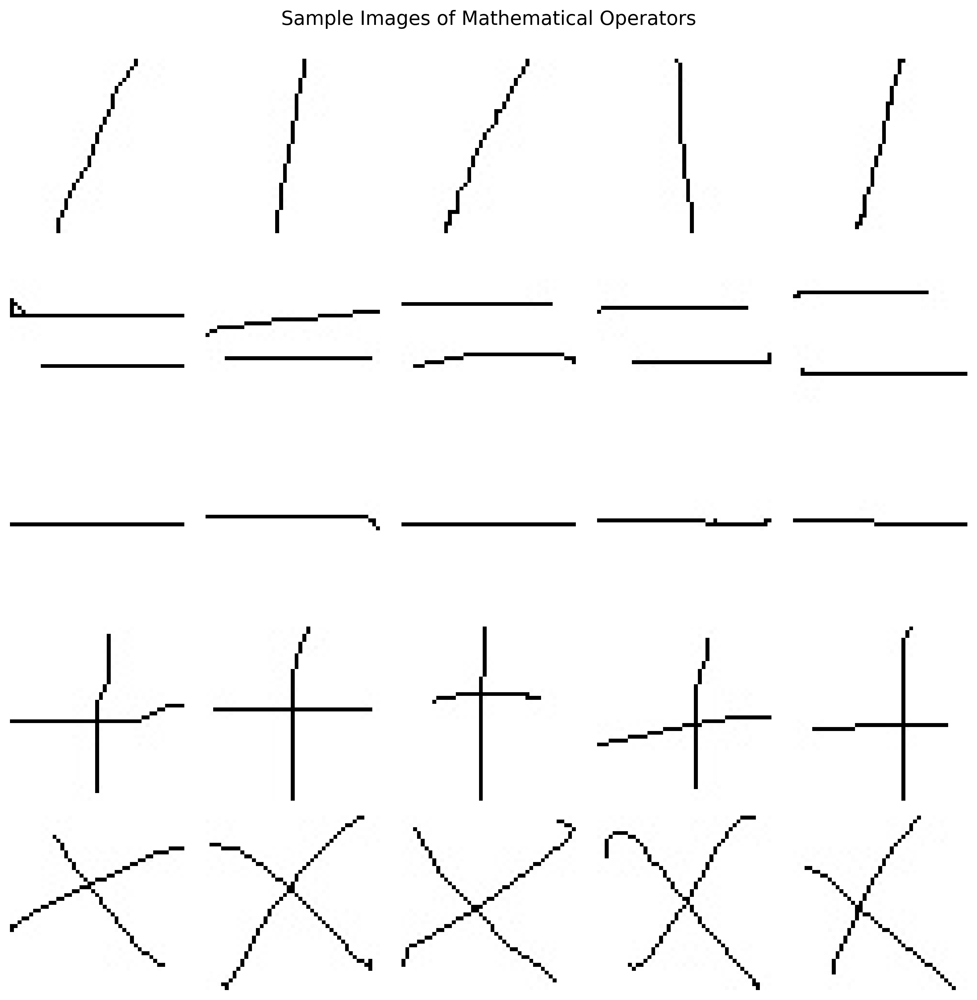

Esta imagen ilustra cómo se ven las muestras de operadores en el dataset. Se pueden observar variaciones en la escritura de cada operador, lo que representa un desafío para su detección y clasificación.

### 📊 Distribución de las Imágenes en el Dataset
El siguiente histograma muestra la cantidad de imágenes disponibles para cada operador en el conjunto de datos:

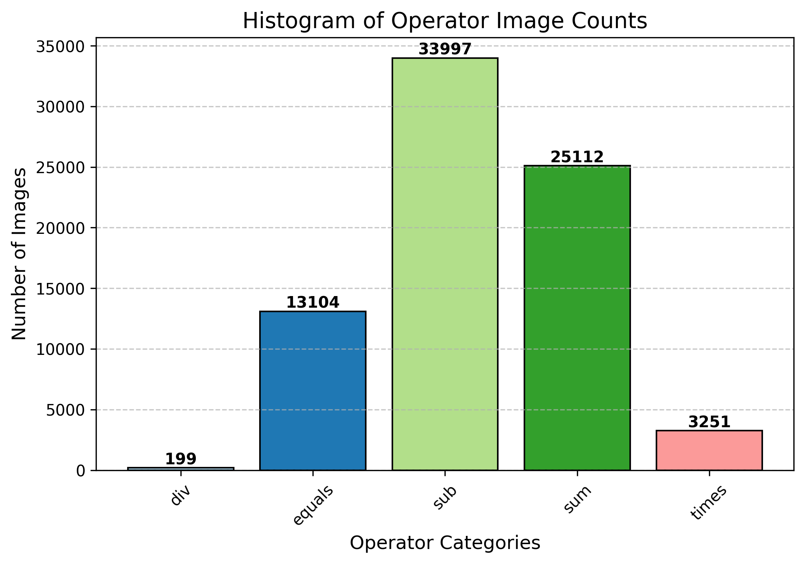

En este histograma se observa la cantidad de imágenes disponibles para cada uno de los operadores utilizados en **Inksolver**. Se pueden destacar los siguientes puntos clave:

- **El operador `sub` (resta) es el más representado**, con un total de **33,997 imágenes**, seguido de `sum` (suma) con **25,112 imágenes**.
- **El operador `equals` (=) cuenta con 13,104 imágenes**, lo que también le da una representación considerable en el dataset.
- **El operador `times` (multiplicación, ×) tiene una cantidad significativamente menor de imágenes, con solo 3,251**.
- **El operador `div` (división, /) es el menos representado en el conjunto de datos, con solo 199 imágenes**, lo que podría impactar en la precisión del modelo para este caso.

### 📊 Proporción de operadores en el dataset
Además del histograma, el siguiente gráfico de pastel muestra la proporción relativa de cada operador en el conjunto de datos:

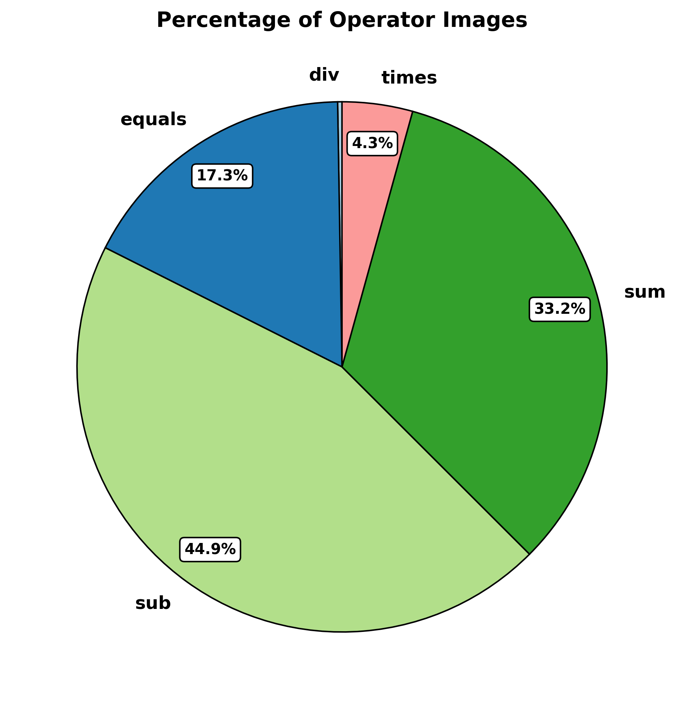

Este gráfico permite visualizar la participación relativa de cada operador dentro del dataset. Se puede observar que:

- **Los operadores `sub` (resta) y `sum` (suma) representan la mayoría de los datos**, con una distribución dominante.
- **El operador `times` (multiplicación) y `equals` (=) tienen una presencia considerablemente menor** en comparación con los anteriores.
- **El operador `div` (división) tiene menos del 1% de los datos disponibles, razón por la cual no aparece en el gráfico**.

La baja representación del operador de división (`/`) puede significar un reto en su análisis. Esto sugiere que, en futuras versiones del proyecto, sería recomendable evaluar cómo afecta esta distribución al desempeño del reconocimiento de operadores y considerar si se requieren ajustes en el procesamiento.

---

### 🖥️ Generación de las Gráficas
Todas las gráficas presentadas en esta sección han sido generadas mediante **scripts en Python** que forman parte del repositorio de **Inksolver**. Estos scripts se encuentran en la carpeta `src/operators/` y permiten visualizar y analizar los datos del conjunto de operadores.

Los archivos disponibles en esta carpeta son:

- **`histogram_operators.py`** → Genera el histograma de distribución de operadores (`operator_histogram.png`).
- **`piechart_operators.py`** → Genera el gráfico de pastel con la proporción de operadores (`operator_piechart.png`).
- **`visualize_operators.py`** → Genera una muestra de imágenes de operadores (`operator_samples.png`).

Para ejecutar cada uno de estos scripts correctamente, sigue los siguientes pasos:

1. **Abrir una terminal** y navegar a la carpeta de los scripts con el siguiente comando:
   ```bash
   cd src/operators/
   ```

2. **Ejecutar el script deseado** con el intérprete de Python:
   ```bash
   python histogram_operators.py
   ```
   ```bash
   python piechart_operators.py
   ```
   ```bash
   python visualize_operators.py
   ```

Esto generará automáticamente las imágenes en la carpeta de salida definida en cada script.

📌 **Nota:** Asegúrate de tener instaladas las dependencias necesarias ejecutando:
```bash
pip install -r src/requirements.txt
```
Si los scripts requieren modificaciones o ajustes en la visualización, puedes editarlos directamente en la carpeta `src/operators/`.

---

## 🤖 Método de Reconocimiento de Operadores
El reconocimiento de operadores en **Inksolver** se basa en un análisis de proyecciones en diferentes ejes, lo que permite detectar los picos característicos en los histogramas normalizados. El proceso se lleva a cabo en los siguientes pasos:

---

### 📌 1. Proyección en los Ejes Horizontal y Vertical + Cálculo Normalizado  

Para analizar la estructura de los operadores, se genera una proyección de la imagen en los ejes **horizontal** y **vertical**. Esto permite visualizar la distribución de los píxeles y detectar patrones característicos en cada operador. La proyección se normaliza para mantener la escala uniforme y facilitar la comparación entre diferentes operadores.

A continuación, se presentan las proyecciones de cada operador con su respectivo análisis:

#### ➗ Proyección del Operador `div` (División)  
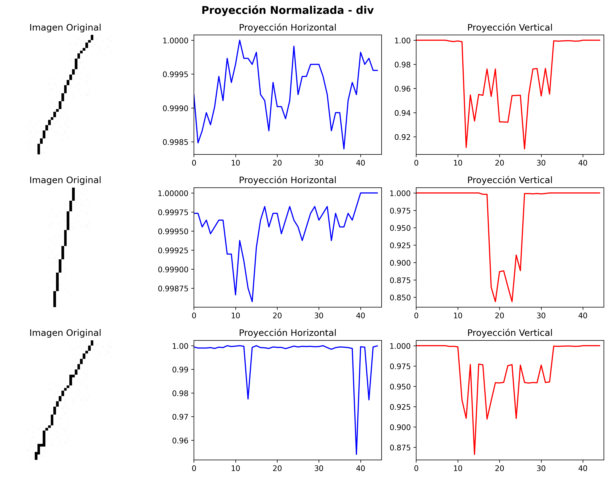

**Análisis:**  
- La imagen original muestra una línea diagonal, característica del operador `/`.
- En la **proyección horizontal** (gráfico azul), se observa una fluctuación en la densidad de píxeles, con picos y valles que reflejan la inclinación de la línea.
- La **proyección vertical** (gráfico rojo) tiene una caída pronunciada en el centro, indicando que la mayor parte de los píxeles están distribuidos en los extremos superior e inferior.

---

#### 🔗 Proyección del Operador `equals` (Igual)  
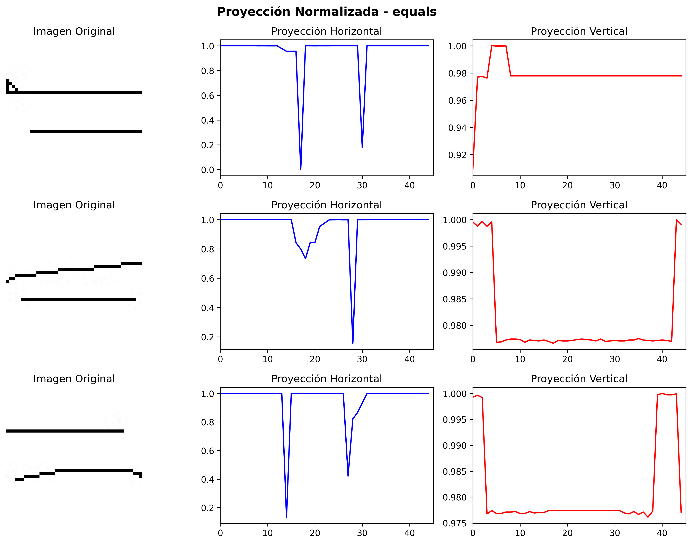

**Análisis:**  
- La imagen original muestra dos líneas horizontales, características del operador `=`.
- En la **proyección horizontal**, se pueden notar valles bien definidos que representan la separación entre ambas líneas.
- En la **proyección vertical**, se observa una distribución más estable con menor variabilidad, indicando que la mayor parte de los píxeles están concentrados a lo largo del eje horizontal.

---

#### ➖ Proyección del Operador `sub` (Resta)  
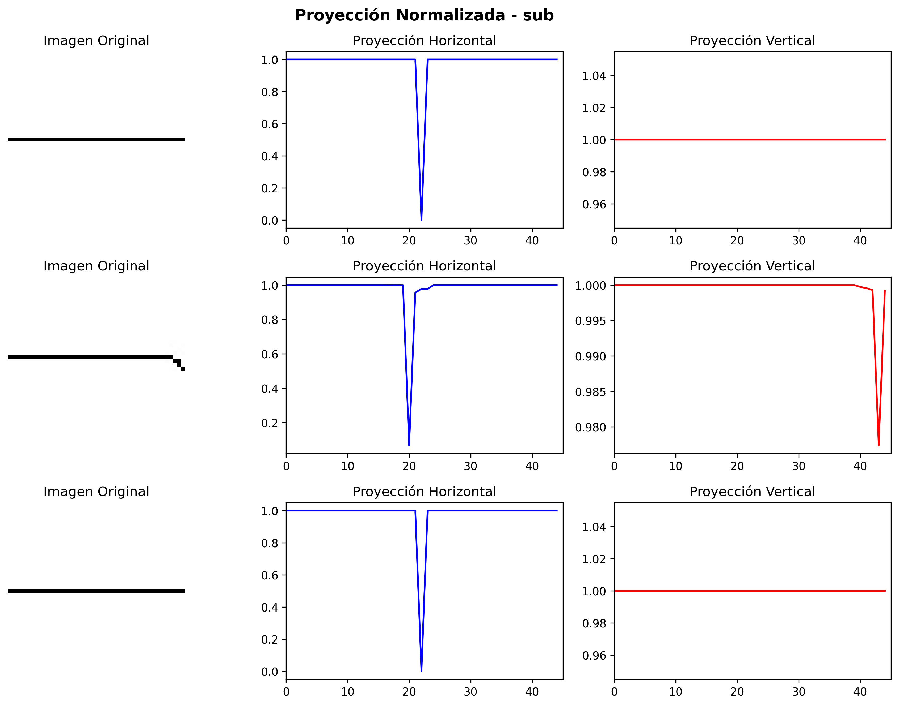

**Análisis:**  
- La imagen original muestra una única línea horizontal, representando el operador `-`.
- En la **proyección horizontal**, se observa un valle pronunciado en la región donde se encuentra la línea.
- La **proyección vertical** es prácticamente constante, ya que la mayor parte de los píxeles están concentrados en una única franja horizontal.

---

#### ➕ Proyección del Operador `sum` (Suma)  
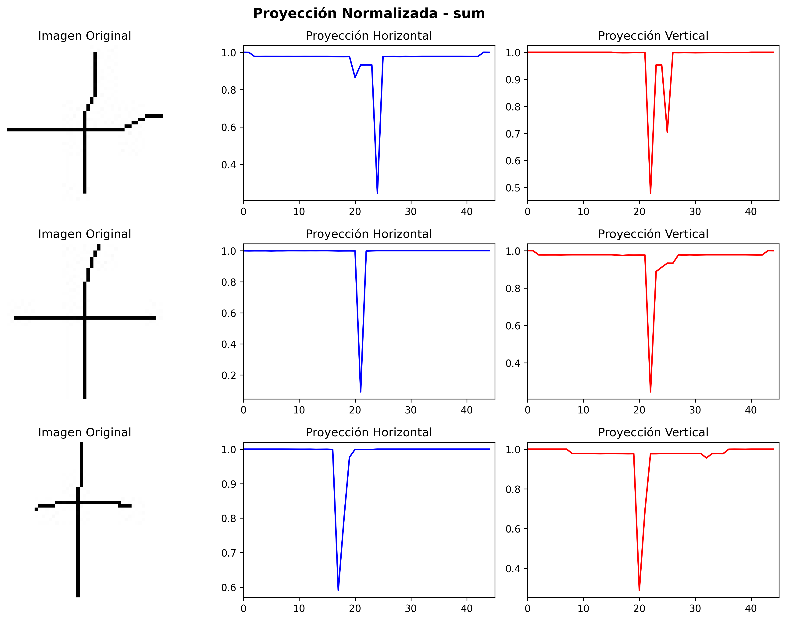

**Análisis:**  
- La imagen original muestra dos líneas perpendiculares que forman el símbolo `+`.
- En la **proyección horizontal**, se observan dos valles bien definidos, correspondientes a la presencia de la línea vertical en el centro.
- En la **proyección vertical**, se presentan dos caídas similares, reflejando la distribución de los píxeles en la línea horizontal.

---

#### ✖️ Proyección del Operador `times` (Multiplicación)  
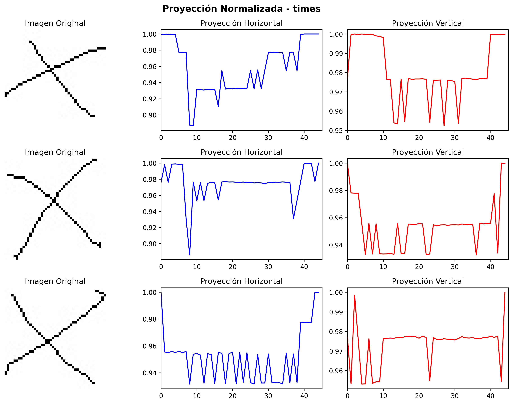

**Análisis:**  
- La imagen original muestra dos líneas diagonales cruzadas formando el operador `×`.
- En la **proyección horizontal**, se observan múltiples variaciones, reflejando la intersección de ambas líneas.
- En la **proyección vertical**, se aprecian picos irregulares, indicando la presencia de líneas diagonales en distintos puntos del eje.

---

### 🖥️ Código para la Generación de Proyecciones  

El código utilizado para generar estas proyecciones se encuentra en el archivo **`projection_operators.py`**, ubicado en la carpeta `src/operators/`. Este script permite calcular las proyecciones horizontal y vertical de los operadores y normalizarlas para su análisis.

Para ejecutar el script correctamente, sigue estos pasos:

1. **Abrir una terminal** y navegar a la carpeta de los scripts con el siguiente comando:
   ```bash
   cd src/operators/
   ```

2. **Ejecutar el script con el intérprete de Python**:
   ```bash
   python projection_operators.py
   ```

Esto generará automáticamente las imágenes de proyección en la carpeta de salida definida en el script.

📌 **Nota:** Asegúrate de tener instaladas las dependencias necesarias ejecutando:
```bash
pip install -r src/requirements.txt
```
Si el script requiere ajustes o mejoras, puedes modificarlo directamente en la carpeta `src/operators/`.

---

### 📌 2. Rotación de 45 Grados + Nueva Proyección y Normalización  

Para mejorar la identificación de ciertos operadores, se aplica una **rotación de 45 grados** antes de realizar nuevamente el cálculo de la proyección normalizada. Esta técnica permite resaltar características clave que pueden ser difíciles de distinguir en la proyección estándar.

A continuación, se presentan las proyecciones después de la rotación junto con un análisis de cada operador:

#### ➗ Proyección del Operador `div` (División) después de la rotación  
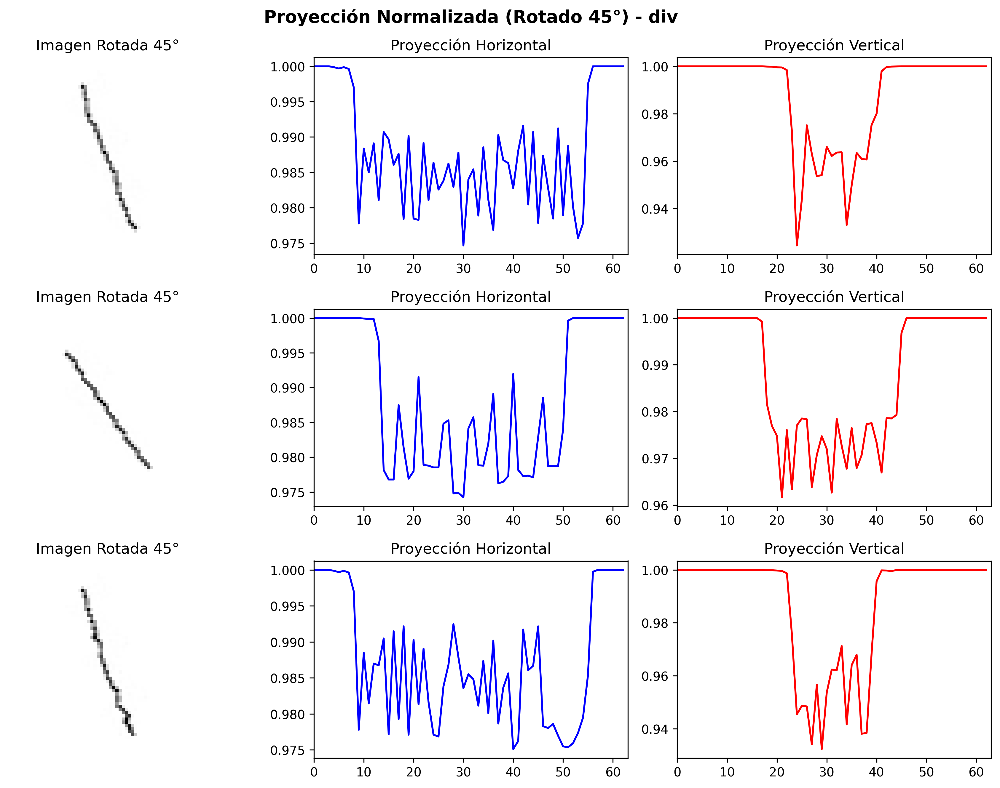

**Análisis:**  
- La imagen original muestra una línea diagonal (`/`), y al rotarla 45° se vuelve más vertical, lo que permite una mejor diferenciación en los ejes.
- En la **proyección horizontal** (gráfico azul), se observa una mayor variabilidad debido a la inclinación del trazo.
- En la **proyección vertical** (gráfico rojo), se generan picos más pronunciados, resaltando la estructura alargada de la línea.

---

#### 🔗 Proyección del Operador `equals` (Igual) después de la rotación  
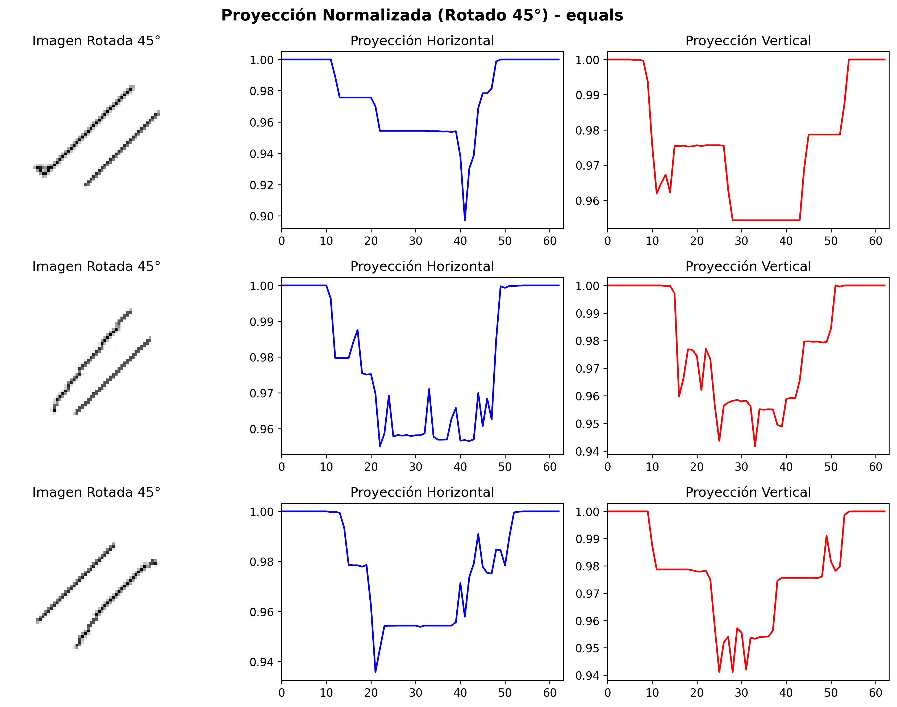

**Análisis:**  
- La imagen original con dos líneas horizontales se transforma en dos líneas diagonales tras la rotación.
- En la **proyección horizontal**, los valles característicos de la separación entre las líneas se vuelven más pronunciados.
- En la **proyección vertical**, la densidad de píxeles cambia, pero la estructura de los dos trazos sigue siendo visible.

---

#### ➖ Proyección del Operador `sub` (Resta) después de la rotación  
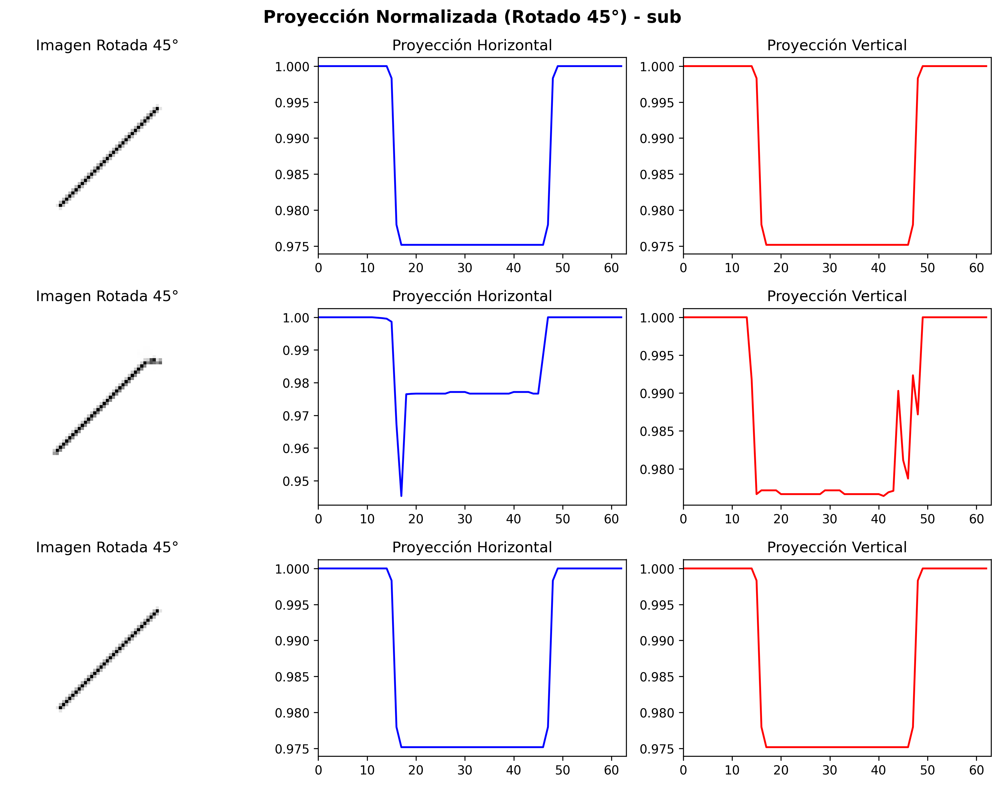

**Análisis:**  
- Al rotar la línea horizontal (`-`) 45°, se inclina y su forma cambia drásticamente.
- En la **proyección horizontal**, se observan cambios menos abruptos debido a la forma del operador.
- En la **proyección vertical**, la estructura se mantiene con una franja de densidad central clara.

---

#### ➕ Proyección del Operador `sum` (Suma) después de la rotación  
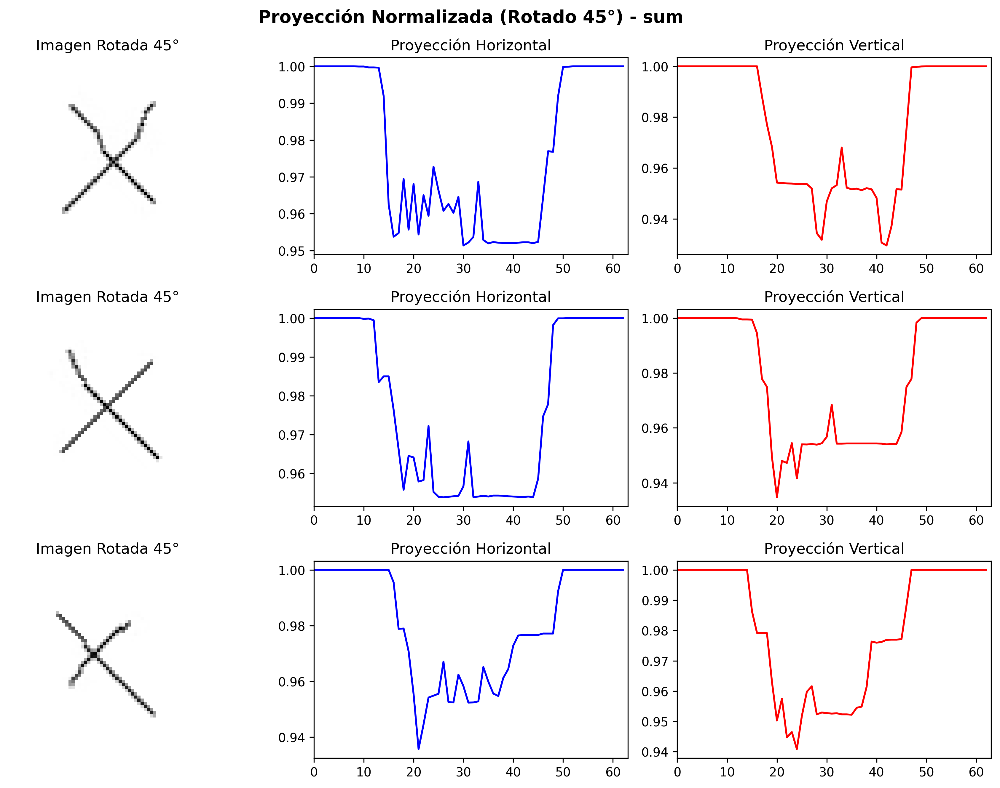

**Análisis:**  
- La imagen del `+` se transforma en una `X` tras la rotación.
- En la **proyección horizontal**, se observan caídas más pronunciadas debido a la intersección de las líneas.
- En la **proyección vertical**, se generan múltiples valles, reflejando la estructura cruzada del operador.

---

#### ✖️ Proyección del Operador `times` (Multiplicación) después de la rotación  
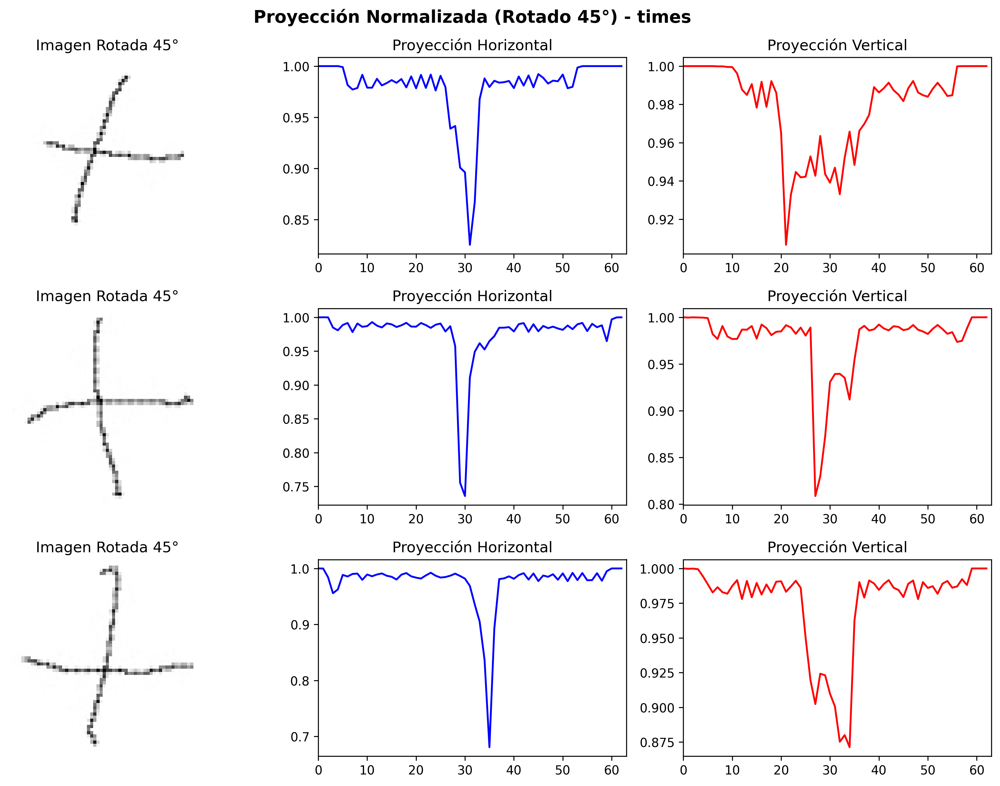

**Análisis:**  
- La imagen original del `×` cambia su orientación tras la rotación de 45°.
- En la **proyección horizontal**, la estructura se vuelve más simétrica.
- En la **proyección vertical**, se observan picos bien definidos que corresponden a la intersección de las líneas diagonales.

---

### 🖥️ Código para la Generación de Proyecciones Rotadas  

El código utilizado para generar estas proyecciones después de la rotación se encuentra en el archivo **`projection_rotated_operators.py`**, ubicado en la carpeta `src/operators/`. Este script permite calcular la proyección normalizada después de aplicar una rotación de 45 grados.

Para ejecutar el script correctamente, sigue estos pasos:

1. **Abrir una terminal** y navegar a la carpeta de los scripts con el siguiente comando:
   ```bash
   cd src/operators/
   ```

2. **Ejecutar el script con el intérprete de Python**:
   ```bash
   python projection_rotated_operators.py
   ```

Esto generará automáticamente las imágenes de proyección rotada en la carpeta de salida definida en el script.

📌 **Nota:** Asegúrate de tener instaladas las dependencias necesarias ejecutando:
```bash
pip install -r src/requirements.txt
```
Si el script requiere ajustes o mejoras, puedes modificarlo directamente en la carpeta `src/operators/`.

---

### 📌 3. Reglas de Detección  

A partir del análisis completo de las proyecciones originales y rotadas, se han identificado patrones consistentes en la cantidad de picos detectados en las gráficas. Estos patrones permiten establecer reglas para clasificar de manera precisa cada operador matemático.

#### 🔍 Análisis General de las Proyecciones  
La siguiente imagen resume el proceso realizado sobre los operadores, desde su imagen original hasta la proyección rotada, permitiendo visualizar las diferencias clave entre cada uno:

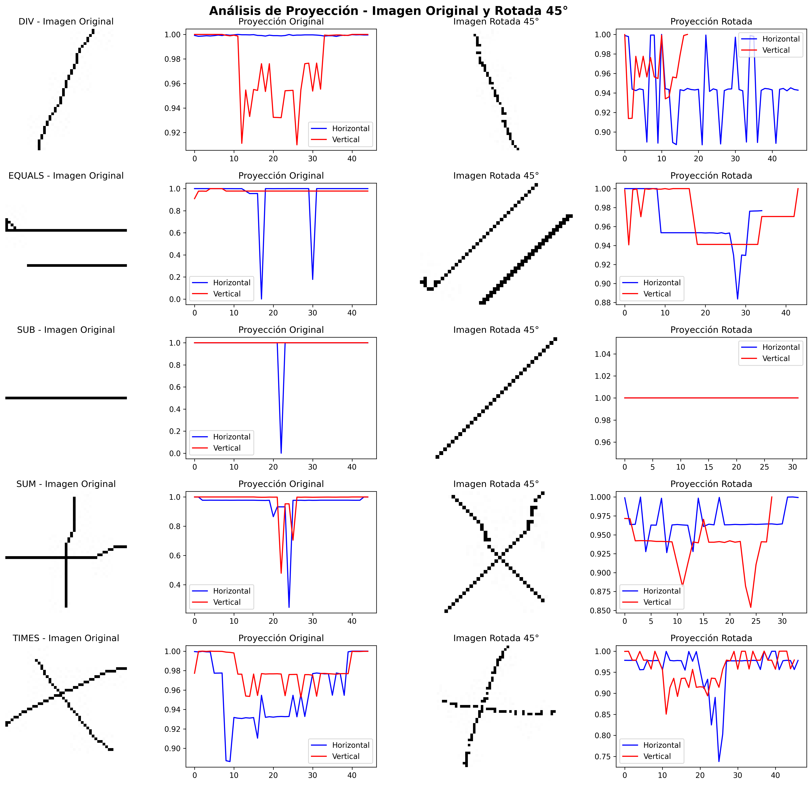

En este análisis, se observan diferencias significativas en la cantidad de picos generados en las proyecciones horizontal y vertical, tanto en la imagen original como en la rotada. Estas diferencias pueden aprovecharse para desarrollar un criterio sistemático de clasificación.

---

#### 🖥️ Código para la Generación del Resumen de Proyecciones  

El código utilizado para generar esta imagen se encuentra en el archivo **`projection_rotated_cropped_operators.py`**, ubicado en la carpeta `src/operators/`. Este script permite visualizar el resumen de todo el proceso aplicado a los operadores.

Para ejecutar el script correctamente, sigue estos pasos:

1. **Abrir una terminal** y navegar a la carpeta de los scripts con el siguiente comando:
   ```bash
   cd src/operators/
   ```

2. **Ejecutar el script con el intérprete de Python**:
   ```bash
   python projection_rotated_cropped_operators.py
   ```

Esto generará automáticamente la imagen de resumen en la carpeta de salida definida en el script.

📌 **Nota:** Asegúrate de tener instaladas las dependencias necesarias ejecutando:
```bash
pip install -r src/requirements.txt
```
Si el script requiere ajustes o mejoras, puedes modificarlo directamente en la carpeta `src/operators/`.

---

#### 📊 Estrategia de Clasificación  
Para la detección del operador, se ha definido un método basado en el conteo de picos en las proyecciones. El proceso se divide en dos pasos:

1. **Cálculo de la cantidad de picos en cada proyección**  
   - Se analiza la proyección horizontal y vertical de la imagen original.
   - Se realiza la misma evaluación sobre la imagen rotada 45°.
   - Para contar un pico, se considera que un punto es válido si sobrepasa un umbral predefinido y posteriormente regresa a un valor inferior.

2. **Aplicación de reglas de clasificación**  
   - A partir de los valores obtenidos, se establecen reglas que permiten identificar cada operador con base en la cantidad y distribución de picos.
   - Cada operador presenta un comportamiento único:
     - **División (`/`)**: No presenta picos en la imagen original, pero puede tener más de dos en la imagen rotada.
     - **Igual (`=`)**: Presenta exactamente dos picos en la proyección horizontal y ninguno en la vertical.
     - **Resta (`-`)**: Se detecta un único pico en la proyección horizontal y ninguno en la vertical.
     - **Suma (`+`)**: Se identifican un pico en la proyección horizontal y otro en la vertical.
     - **Multiplicación (`×`)**: No tiene picos en la imagen original, pero la imagen rotada genera hasta dos picos.

Estas reglas permiten diferenciar los operadores con un alto grado de precisión, utilizando únicamente técnicas tradicionales de procesamiento de imágenes y análisis de histogramas de proyección. 

---

## 📊 Validación del Modelo  

Para evaluar el desempeño del modelo basado en las reglas de detección establecidas, se utilizó la totalidad de las imágenes del conjunto de datos de operadores. Cada imagen fue procesada utilizando las reglas definidas previamente, generando una predicción sobre la categoría del operador detectado.  

A partir de estas predicciones, se construyó la siguiente **matriz de confusión**, la cual proporciona una visión detallada del desempeño del modelo en términos de aciertos y errores por cada categoría de operador:

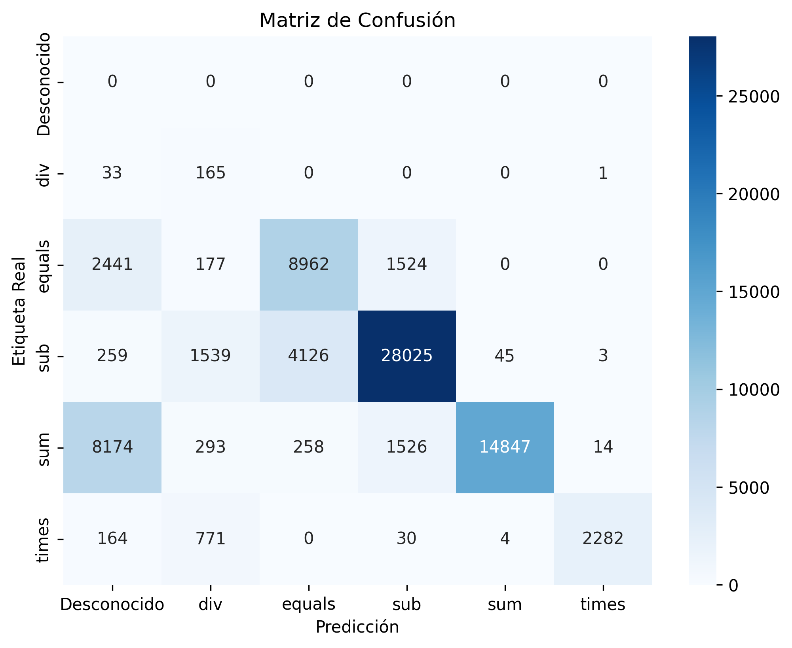

En esta matriz, las filas representan las **clases reales** de los operadores (etiquetas originales del conjunto de datos), mientras que las columnas representan las **predicciones realizadas por el modelo**. La diagonal principal indica el número de casos correctamente clasificados, mientras que los valores fuera de la diagonal representan errores de clasificación. Además, se incluyó una categoría **"Desconocido"**, la cual captura los casos en los que el modelo no pudo determinar con certeza el operador presente en la imagen.

---

### ✅ Precisión Global del Modelo  

El modelo alcanzó una **precisión global del 71.74%**, lo que significa que, en promedio, **7 de cada 10 operadores fueron clasificados correctamente**.  

Este resultado se calcula como la fracción de predicciones correctas sobre el total de muestras evaluadas. A pesar de tratarse de un método basado en reglas tradicionales sin el uso de técnicas avanzadas de inteligencia artificial, la precisión obtenida es competitiva y demuestra que el enfoque de análisis de proyección es efectivo para la clasificación de operadores matemáticos escritos a mano.

---

### 📊 Análisis de Precisión por Clase  

Para comprender mejor el desempeño del modelo en cada operador, se presenta el siguiente análisis detallado de cada categoría evaluada en el conjunto de validación:

#### 🔹 **División (`/`)**  
- **Precisión:** 5.60%  
- **Recall:** 82.91%  
- **Especificidad:** 96.32%  
- **F1-Score:** 10.50%  

📌 **Interpretación:**  
El modelo detecta correctamente la mayoría de los operadores `/` (alto recall), pero también los clasifica erróneamente en otras categorías (baja precisión). Esto puede deberse a la baja cantidad de muestras disponibles para este operador en el conjunto de datos, lo que dificulta la correcta identificación de patrones distintivos.

---

#### 🔹 **Igual (`=`)**  
- **Precisión:** 67.15%  
- **Recall:** 68.39%  
- **Especificidad:** 92.99%  
- **F1-Score:** 67.77%  

📌 **Interpretación:**  
El operador `=` presenta una clasificación razonablemente precisa, aunque con margen de mejora. El **recall del 68.39%** indica que casi **7 de cada 10 operadores `=` fueron correctamente identificados**, mientras que la precisión del **67.15%** muestra que aún existen algunas confusiones con otras categorías, principalmente `sub` y `sum`, cuyos histogramas pueden compartir ciertas características.

---

#### 🔹 **Resta (`-`)**  
- **Precisión:** 90.10%  
- **Recall:** 82.43%  
- **Especificidad:** 92.61%  
- **F1-Score:** 86.10%  

📌 **Interpretación:**  
El operador `-` fue identificado con alta precisión, logrando un **90.10%** de acierto en sus predicciones. Sin embargo, algunas muestras de `=` y `sum` fueron clasificadas erróneamente como `sub`, lo que afectó el **recall (82.43%)**. Esto sugiere que la estrategia de clasificación funciona bien para este operador, aunque con posibles mejoras en la diferenciación con `=`.

---

#### 🔹 **Suma (`+`)**  
- **Precisión:** 99.67%  
- **Recall:** 59.12%  
- **Especificidad:** 99.90%  
- **F1-Score:** 74.22%  

📌 **Interpretación:**  
La clasificación del operador `+` es **extremadamente precisa (99.67%)**, lo que significa que, cuando el modelo predice `sum`, casi siempre está en lo correcto. No obstante, el **recall del 59.12%** sugiere que muchas instancias de `sum` fueron clasificadas erróneamente como otros operadores, especialmente `equals` y `sub`. Esto se debe a la similitud en las proyecciones cuando las líneas no son perfectamente perpendiculares.

---

#### 🔹 **Multiplicación (`×`)**  
- **Precisión:** 99.22%  
- **Recall:** 70.19%  
- **Especificidad:** 99.98%  
- **F1-Score:** 82.22%  

📌 **Interpretación:**  
El modelo identifica el operador `×` con **alta precisión (99.22%)**, pero el **recall del 70.19%** indica que cerca del **30% de los operadores `×` fueron clasificados erróneamente**. La principal confusión ocurre con `sum`, ya que ambos presentan intersecciones en sus líneas. La rotación de 45° ayudó a mejorar la clasificación, pero sigue siendo un desafío distinguirlos en ciertos casos.

---

### 📌 Conclusiones de la Validación  

1️⃣ **El modelo basado en reglas logró una precisión global del 71.74%**, lo que indica que es un método funcional y efectivo para reconocer operadores matemáticos escritos a mano sin el uso de inteligencia artificial.  

2️⃣ **El operador con mejor rendimiento fue la resta (`-`), con un 90.10% de precisión**, seguido por la multiplicación (`×`) y la suma (`+`), que presentaron buenos niveles de especificidad y precisión.  

3️⃣ **La división (`/`) tuvo el desempeño más bajo debido a la baja cantidad de muestras en el conjunto de datos**, lo que afectó su capacidad de generalización.  

4️⃣ **La estrategia de rotación de 45° mejoró la detección del operador `×`, pero aún existen confusiones con `+` y `-`**, lo que sugiere que podrían implementarse mejoras en la discriminación entre estos símbolos.  

5️⃣ **La clase "Desconocido" permitió capturar errores de predicción, pero su uso es limitado**, ya que en muchos casos el modelo clasifica erróneamente en otras categorías en lugar de asignar esta clase.  

🔹 **En general, este análisis demuestra que la técnica de proyección y conteo de picos es efectiva para la clasificación de operadores matemáticos escritos a mano. Sin embargo, ciertas mejoras en las reglas de detección podrían optimizar aún más la precisión del modelo.**  

---


### 🖥️ Código para la Clasificación y Validación  

El código utilizado para generar las predicciones y validar el desempeño del modelo se encuentra en la carpeta **`src/operators/`** y está dividido en dos scripts principales:

- **`operator_classification.py`**: Se encarga de aplicar las reglas de clasificación definidas en la sección anterior a cada imagen del conjunto de datos y generar las predicciones de los operadores.
- **`validate_classification.py`**: Utiliza las predicciones generadas para construir la matriz de confusión y calcular métricas de desempeño como precisión, recall, especificidad y F1-score.

Para ejecutar el proceso de clasificación y validación correctamente, sigue estos pasos:

1. **Abrir una terminal** y navegar a la carpeta de los scripts con el siguiente comando:
   ```bash
   cd src/operators/
   ```

2. **Ejecutar el script de clasificación para obtener las predicciones**:
   ```bash
   python operator_classification.py
   ```
   Este script generará un archivo con las predicciones realizadas por el modelo para cada imagen.

3. **Ejecutar el script de validación para analizar los resultados**:
   ```bash
   python validate_classification.py
   ```
   Esto generará la **matriz de confusión** y calculará las métricas de validación, generando la imagen `confusion_matrix.png`.

📌 **Nota:** Asegúrate de tener instaladas las dependencias necesarias ejecutando:
```bash
pip install -r src/requirements.txt
```
Si el script requiere ajustes o mejoras, puedes modificarlo directamente en la carpeta `src/operators/`.

---

## 📝 Generación de un Nuevo Conjunto de Datos y Validación  

Para evaluar la capacidad del modelo en condiciones reales, se trabajó en la creación de un nuevo conjunto de datos basado en operadores matemáticos escritos a mano. Este conjunto fue generado manualmente siguiendo un formato estructurado, asegurando que las imágenes se ajustaran a las condiciones esperadas por el modelo.

### ✍️ Creación del Conjunto de Datos de Prueba  
El conjunto de datos de prueba se compone de imágenes escritas a mano de los cinco operadores utilizados en este estudio: `div`, `equals`, `sub`, `sum` y `times`.  

Cada imagen sigue un **formato estructurado**, lo que facilita su identificación y clasificación dentro del proceso de validación. Ejemplos de imágenes generadas incluyen:  

- **División (`div_001.png`):**  
  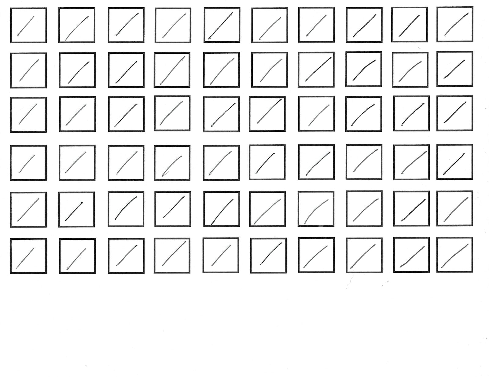

- **Igual (`equals_001.png`):**  
  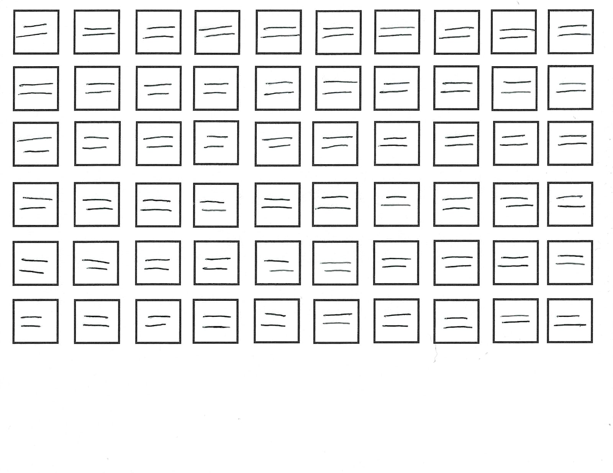

- **Resta (`sub_001.png`):**  
  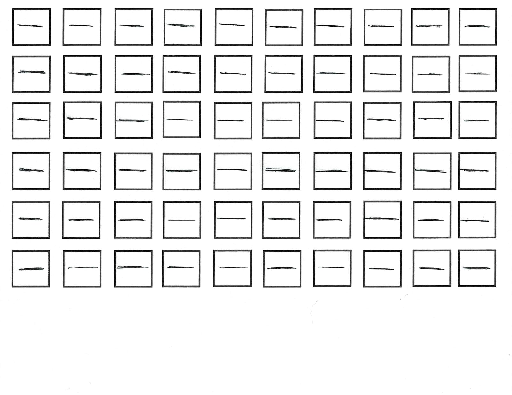

- **Suma (`sum_001.png`):**  
  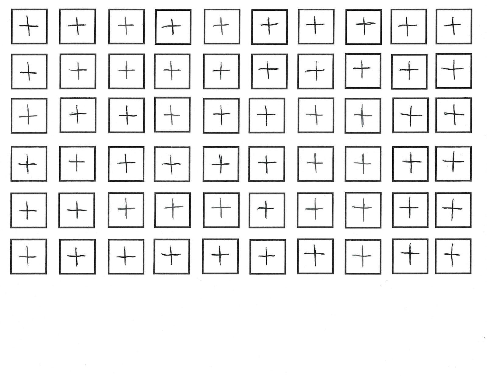

- **Multiplicación (`times_001.png`):**  
  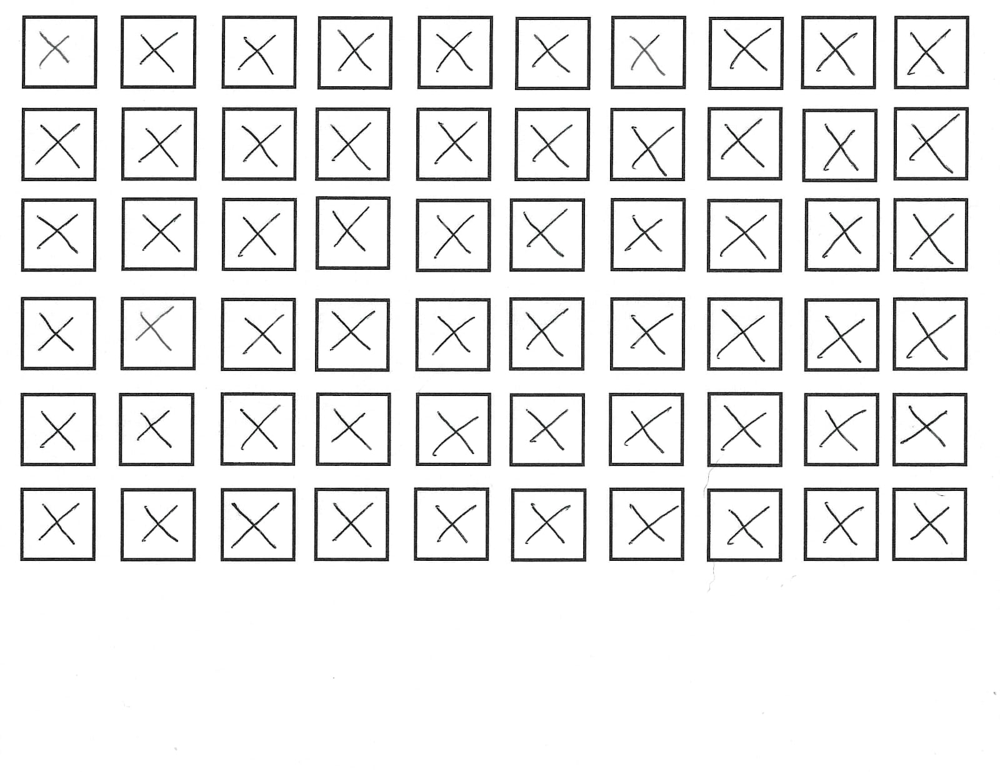

📄 **Formato utilizado:**  
El documento de referencia con el formato utilizado para la escritura manual de los operadores se encuentra en **[Testing_Format.pdf](../format/Testing_Format.pdf)**. Este documento define los criterios y estructura empleados en la recolección de los datos.

---

### 📊 Distribución de Imágenes en el Conjunto de Prueba  

Para garantizar que el conjunto de prueba sea equilibrado, se generó un histograma que muestra la cantidad de ejemplos para cada una de las clases incluidas en la evaluación:

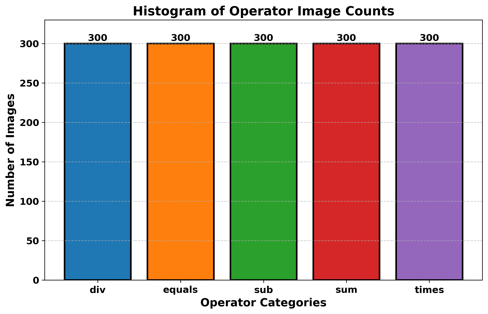

El histograma confirma que todas las categorías contienen una cantidad balanceada de muestras, permitiendo una evaluación justa del modelo sin sesgos en la frecuencia de aparición de cada operador.

Además, se presenta un **gráfico de pastel (pie chart)** que ilustra la distribución porcentual de cada clase dentro del conjunto de prueba:

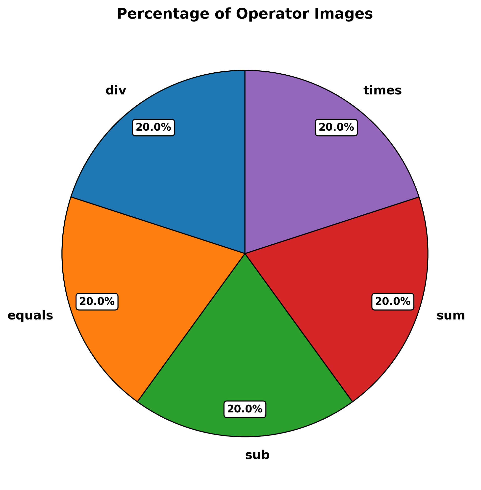

El gráfico de pastel refuerza la uniformidad del conjunto de datos, mostrando que cada operador representa aproximadamente el **20% del total de imágenes**, lo que permite una evaluación equilibrada del desempeño del modelo en todas las categorías.

---

### 📌 Proceso de Clasificación en el Conjunto de Prueba  

El conjunto de datos manuscrito se sometió al mismo proceso de clasificación descrito en secciones anteriores. Se aplicaron las reglas definidas para cada operador, generando las predicciones correspondientes.  

A partir de estas predicciones, se generó la siguiente **matriz de confusión**, que refleja el desempeño del modelo en la identificación de los operadores en este nuevo conjunto de datos:

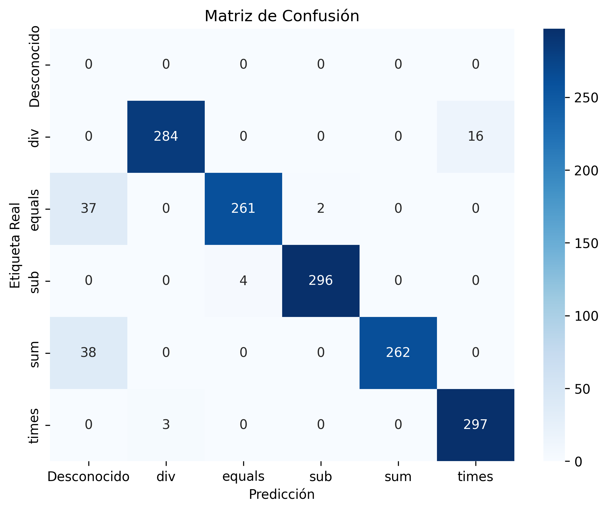

La matriz de confusión muestra un alto nivel de precisión en la clasificación de los operadores, con errores mínimos en algunas categorías.

📌 **Interpretación de la Matriz de Confusión:**
- La matriz de confusión representa las predicciones del modelo en relación con las etiquetas reales.
- Cada fila indica la **clase real** de un operador manuscrito.
- Cada columna indica la **predicción realizada** por el modelo.
- Los valores en la diagonal principal representan **predicciones correctas**, mientras que los valores fuera de la diagonal representan **errores de clasificación**.

### 📌 Análisis de la Matriz de Confusión  

- **Los operadores ‘sub’, ‘sum’ y ‘times’ fueron clasificados con una alta precisión**, mostrando muy pocas confusiones con otras clases.  
- **El operador ‘equals’ tuvo ciertas confusiones con la clase ‘sum’**, lo que sugiere que algunas imágenes de igual fueron interpretadas erróneamente.  
- **El operador ‘div’ presenta una leve confusión con ‘times’**, aunque en general la detección sigue siendo efectiva.  
- **Las filas correspondientes a la clase ‘Desconocido’ están vacías**, lo que indica que no hubo predicciones erróneas categorizadas en esta clase.  

En general, la matriz de confusión confirma que el modelo mantiene una **alta precisión** en la clasificación, aunque con ligeros errores en ciertas clases específicas.

---

### 📊 Resultados de la Validación con el Conjunto de Prueba Expandido  

Tras la clasificación de todas las imágenes manuscritas y la evaluación con la matriz de confusión, se calcularon las métricas de rendimiento del modelo:

📊 **VALIDACIÓN DE CLASIFICACIÓN DE TEST - CONJUNTO EXPANDIDO** 📊

✅ **Precisión Global del Modelo:** **93.33%**

🔹 **Clase 'div':**  
   - 🎯 **Precisión:** 98.95%  
   - 🔍 **Recall:** 94.67%  
   - 🚀 **Especificidad:** 99.75%  
   - ⚖️ **F1-Score:** 96.76%  

🔹 **Clase 'equals':**  
   - 🎯 **Precisión:** 98.49%  
   - 🔍 **Recall:** 87.00%  
   - 🚀 **Especificidad:** 99.67%  
   - ⚖️ **F1-Score:** 92.39%  

🔹 **Clase 'sub':**  
   - 🎯 **Precisión:** 99.33%  
   - 🔍 **Recall:** 98.67%  
   - 🚀 **Especificidad:** 99.83%  
   - ⚖️ **F1-Score:** 99.00%  

🔹 **Clase 'sum':**  
   - 🎯 **Precisión:** 100.00%  
   - 🔍 **Recall:** 87.33%  
   - 🚀 **Especificidad:** 100.00%  
   - ⚖️ **F1-Score:** 93.24%  

🔹 **Clase 'times':**  
   - 🎯 **Precisión:** 94.89%  
   - 🔍 **Recall:** 99.00%  
   - 🚀 **Especificidad:** 98.67%  
   - ⚖️ **F1-Score:** 96.90%  

---

### 🔍 Análisis de los Nuevos Resultados  

Con el aumento en la cantidad de datos de prueba, el modelo sigue mostrando un rendimiento sólido, aunque con una **ligera disminución en la precisión global (de 96.33% a 93.33%)**.  

---

### 🖥️ Código para la Validación del Conjunto de Prueba  

Para realizar esta validación con el conjunto de prueba expandido, se utilizaron los siguientes scripts en **`src/operators/`**:

1️⃣ **`extract_test_images.py`**  
   - Extrae imágenes individuales de los formatos estructurados.  

2️⃣ **`classify_test_images.py`**  
   - Clasifica las imágenes extraídas utilizando las reglas definidas.  

3️⃣ **`validate_test_classification.py`**  
   - Evalúa las predicciones realizadas y genera la matriz de confusión.  

#### 📌 **Ejecución del proceso paso a paso**  

```bash
# Ir a la carpeta de scripts
cd src/operators/

# Extraer imágenes del formato original
python extract_test_images.py

# Clasificar las imágenes extraídas
python classify_test_images.py

# Validar y generar la matriz de confusión
python validate_test_classification.py
```

📌 **Nota:** Asegúrate de tener instaladas las dependencias necesarias ejecutando:
```bash
pip install -r src/requirements.txt
```

---

## 📌 Conclusiones

El análisis y desarrollo de **Inksolver** ha demostrado que la metodología basada en **proyecciones normalizadas y reglas de detección** es efectiva para la clasificación de operadores matemáticos escritos a mano. A través del estudio detallado del dataset de **Kaggle (Handwritten Math Symbols)** y la validación con un conjunto de datos manuscrito propio, se han obtenido resultados significativos.

### ✅ Desempeño en el Conjunto de Datos Original
El modelo logró una **precisión global del 71.74%** en el conjunto de datos original de Kaggle. A pesar de no utilizar técnicas avanzadas de inteligencia artificial, la estrategia basada en **análisis de picos en proyecciones** permitió una correcta clasificación en la mayoría de los casos. Sin embargo, se identificaron ciertas dificultades en la detección de operadores como `div` (división) y `equals` (igual), debido a su menor representación en el conjunto de entrenamiento y a la similitud con otros operadores.

### ✅ Validación en Conjunto de Datos Manuscrito
Para evaluar la capacidad de generalización del modelo, se generó un **nuevo conjunto de datos basado en operadores escritos a mano**, asegurando una distribución balanceada entre las clases. Tras aplicar el mismo proceso de clasificación y validación, se obtuvo una **precisión global del 93.33%**, demostrando que el modelo puede adaptarse a datos reales con un alto grado de confiabilidad.

- **Los operadores `sub`, `sum` y `times` alcanzaron una precisión cercana al 99%**, lo que indica que los patrones de proyección identificados son robustos.
- **El operador `equals` tuvo ciertos errores de clasificación con `sum`**, sugiriendo la necesidad de ajustes en la diferenciación de líneas horizontales cercanas.
- **El operador `div` mostró una ligera confusión con `times`**, pero su desempeño mejoró significativamente con el incremento de datos de prueba.

### 🔍 Puntos Clave y Mejoras Futuras
1️⃣ **Robustez del modelo sin IA**  
   - Se ha demostrado que el análisis basado en **proyecciones normalizadas y reglas de detección** es suficiente para clasificar correctamente operadores matemáticos escritos a mano.
   - La estrategia funciona bien tanto en un conjunto de datos preexistente (Kaggle) como en uno generado manualmente.

2️⃣ **Impacto de la cantidad de datos**  
   - Se confirmó que la **baja cantidad de muestras de `div` en el dataset original afectó su clasificación**.
   - En el conjunto manuscrito, al tener más ejemplos balanceados, el rendimiento mejoró notablemente.

3️⃣ **Generalización del método**  
   - El enfoque empleado puede aplicarse a otros conjuntos de datos manuscritos sin necesidad de ajustes complejos.
   - Su implementación es simple y eficiente, ya que no requiere entrenamiento extensivo como en modelos basados en aprendizaje profundo.

4️⃣ **Áreas de mejora**  
   - Se podrían refinar las reglas de clasificación para mejorar la diferenciación de operadores con características similares (`equals` y `sub`).
   - Implementar técnicas adicionales de normalización o transformación de imágenes para mejorar la separación entre clases confusas.
   - Explorar enfoques híbridos, combinando las reglas actuales con técnicas más avanzadas, como modelos basados en redes neuronales para mejorar los casos más ambiguos.

### 🔹 Conclusión Final  
El modelo desarrollado en **Inksolver** proporciona una solución eficiente y confiable para la **detección y clasificación de operadores matemáticos manuscritos**. Su desempeño ha sido validado con éxito en distintos conjuntos de datos, logrando una **alta precisión en un entorno realista**.  

El estudio demuestra que **es posible realizar clasificación de operadores sin el uso de inteligencia artificial avanzada**, utilizando únicamente técnicas tradicionales de análisis de imágenes. Sin embargo, el refinamiento del proceso podría aumentar aún más su precisión y robustez, permitiendo futuras mejoras en su aplicación.

---